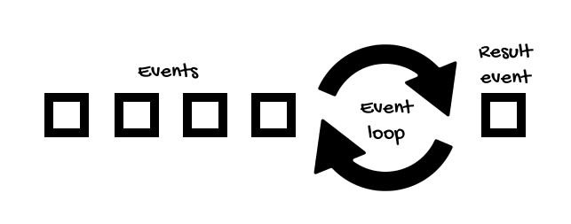
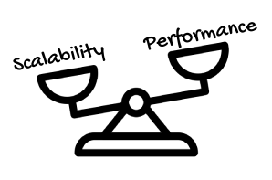
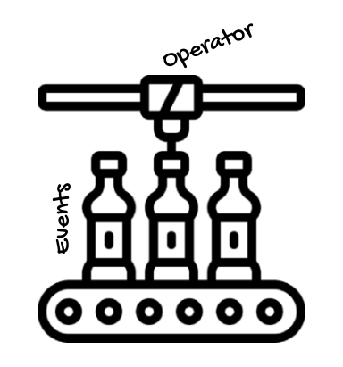

# Non-blocking, Asynchronous, and Functional
* * *
Going back to our grocery store example, imagine you go shopping for some fruit.


After picking the fruit you want:
- You wait for your turn to arrive at the checkout
- The cashier tells you the price
- You pay for it
- And get out of the store. 

Let's say all this took around 10 minutes.

Now, wouldn't it be great if we could just arrive directly at the cashier, ask for the fruit we want, and go maybe for a coffee while our order is being processed?


When the order is ready, we could receive a call to pick it up and pay for it, but meanwhile, we could do something else.

What I try to say with this example is that the concepts of non-blocking and asynchronous are closely associated because, if we don't have to wait for an operation to finish (the non-blocking part), we can do something else until we're notified that the operation has finished (the asynchronous part).

A threaded server needs as many threads as it can get because it uses one thread for each request, blocking the execution until the request completes.


On the other hand, non-blocking servers use a small number of threads for handling requests.

When a thread handles a request, this is divided into smaller pieces of work, called events, which are processed fast because if there's a blocking operation (like making a query to the database) or something that takes time (like an intensive computation), this operation is performed by other workers threads, and when it's done, a new event is generated to signal that the operation is completed.



For this reason, a server that works in a non-blocking, asynchronous way, can handle more requests than a threaded server.

However, notice that this is not necessarily related to performance.

If a query takes a second, you still have to wait one second to get the result asynchronously, but this allows you to have the opportunity to work on something else while you wait for the result. Like processing more requests.

So reactive programming is more about scalability (how many requests you can handle with the same hardware) than performance (how much faster you can process requests with the same hardware).



But, when programming asynchronously, how can we get notified when the result of an operation is ready?

Well, traditionally, there are two methods, callbacks and futures.

A callback is an object or method that is passed to another object, which calls the callback when a particular event occur. In Java, callbacks are usually implemented as listeners or event handlers in the observer pattern. Here's an example:
```java
interface MyListener {
    void doSomething();
}

class Observer implements MyListener {
    public void doSomething(){
       System.out.println("Something happened!");
    }
}
class Publisher {
    private List<MyListener> listeners = new ArrayList<MyListener>();

    public void addListener(MyListener listener) {
        listeners.add(listener);
    }
                        
    public void notifySomethingHappened(){
        for(MyListener listener : listeners){
            listener.doSomething();
        }
    }
}
```

The problem is that if you need to nest callbacks, the code can quickly become difficult to read and maintain, an issue commonly known as callback hell.

We also have `Future` objects. In this case, instead of returning the result, a method can return a `Future` object. This way, the method does its job asynchronously, and we can poll the future object until the result is available.
```java
Future<Double> future = getCalculationFuture();

while(!future.isDone()) {
    System.out.println("Calculating...");
    Thread.sleep(500);
}

Double result = future.get();
```

This is better than callbacks, but it's easy to block the execution of the operation, which is not the purpose of asynchronous programming.

Besides, when your logic gets complex, the code also becomes difficult to read and maintain.

On the other hand, reactive libraries like Reactor provide a set of operators that allows you to work at a higher level of abstraction, creating new instances of streams so that one or multiple streams can be used as the input to another one.

This way, we can compose operators that perform asynchronous tasks in a declarative/functional style. 
```java
service.getProduct(productId) 
    .flatMap(productService::getDetails) 
    .switchIfEmpty(historyService.getDetails(productId)) 
    .take(2)
    .onErrorResume(this::getDummyPrices)
    .subscribe();
```

Project Reactor provides many operators, from peeking into a stream to transforming, filtering, taking N elements, or handling errors, for example.

All of this without you having to think about the notification mechanism, concurrency, and other factors. 

Going back to the assembly line analogy, in Reactor's terminology, there's a `Publisher` that generates or publishes events asynchronously, which are transformed by operators asynchronously, and pushed to `Subscribers` only when they subscribe to the stream.



However, something that you always have to keep in mind is that:

> Nothing happens until you subscribe.

This is an important point and we'll come back to it later.

