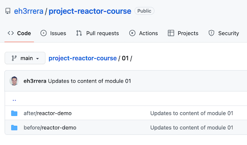

# Project Reactor
* * *
According to its [website](https://projectreactor.io):

> Project Reactor is a fourth-generation reactive library, based on the Reactive Streams specification, for building non-blocking applications on the JVM

Let's break down this definition.

**Fourth-generation reactive library**. Reactive programming and its associated concepts and libraries have evolved. According to [David Karnok's reactive classification](https://akarnokd.blogspot.com/2016/03/operator-fusion-part-1.html):
- The zeroth generation was about implementing the Observer pattern and callbacks in the form of `addListener` methods. 
- The first generation fixed some deficiencies, such as using asynchrony to allow sequences to be canceled. 
- The second generation addressed more problems, such as adding backpressure to signal the number of items a Subscriber can process. 
- The third generation brought compatibility between reactive libraries with the Reactive-Streams specification (more on this next).
- Finally, fourth-generation libraries add optimizations to many operators for performance benefits.

**Based on the [Reactive Streams specification](https://www.reactive-streams.org)**. This specification defines a set of interfaces, methods, and protocols to process streams asynchronously and with backpressure capabilities. Libraries implementing this specification can add features more features, but they must pass the test suites provided by a Technology Compatibility Kit (TCK) and provide an [API that consists of the following components](https://github.com/reactive-streams/reactive-streams-jvm/blob/v1.0.3/README.md#api-components):
- Publisher
- Subscriber
- Subscription
- Processor

**Building non-blocking applications**. Remember, the core of reactive programming is building applications in a non-blocking, asynchronous way for scalability purposes.

**On the JVM**. Reactor works with any language that runs on the Java Virtual Machine (JVM), not just Java. In particular, there are some [extensions for Kotlin](https://projectreactor.io/docs/core/release/reference/#kotlin) (that won´t be covered in this course).

All right, let's see how to set up a project with Reactor.

Reactor Core runs on Java 8 and above. 

I'll use Java 17. I prefer long-term support releases such as Java 8, 11, or 17, but don't worry too much about that. All the demos should run on Java 8 and above.

About the IDE, I recommend [IntelliJ IDEA Community Edition](https://www.jetbrains.com/idea/download/), but you can use any other IDE you prefer.

As the build tool, I'm going to use [Maven](https://maven.apache.org/index.html), but you can use [Gradle](https://gradle.org/) or any other tool you want.

All right, we're going to need an empty Maven project. 

You can use the one I set up in the [GitHub repository of this course](https://github.com/eh3rrera/project-reactor-course).

In the `01` folder, you can find two directories, `after` and `before`.



We'll start with the project in the before directory.

The after directory contains the state of the project at the end.

So if you import the project into your favorite IDE, you'll see there are a couple of empty classes:


And a `pom.xml` file with a set of properties for the Java compiler that you can change according to the version you're using:


In a browser, head over to [mvnrepository.com](https://mvnrepository.com) and search the group ID of Reactor, `io.projectreactor`.

The whole functionality of Reactor is divided into many artifacts:


For example:
- `reactor-core` is the artifact with the main classes of the library.
- `reactor-test` contains the classes for testing reactive streams.
- And `reactor-netty` if for building TCP, UDP, and HTTP servers and clients based on the Netty network application framework, among others.

If you only use one or two of these artifacts, you can always add these artifacts directly to your POM or `build.gradle` file.

However, Reactor also provides a Bill of Materials (BOM) artifact, so you don't have to manually add version information to all the Reactor artifacts you use in your project. A Bill of Materials takes care of that for you, ensuring the compatibility of all the artifacts.

If you click on [Project Reactor 3 Release Train BOM](https://mvnrepository.com/artifact/io.projectreactor/reactor-bom):


You'll see all the versions available. Since October 2020, the naming convention was changed to follow the schema `YYYY.MINOR.PATCH-QUALIFIER`.

If you click on the more recent version, [2022.0.6](https://mvnrepository.com/artifact/io.projectreactor/reactor-bom/2022.0.6) at this time.

You'll see all the dependencies this bill of materials manages:


Artifacts follow a versioning scheme of `MAJOR`, instead of the year, `MINOR` and `PATCH-QUALIFIER`.

So, back to our project, in the `pom.xml` file, we can import the BOM dependency in a `<dependencyManagement>` section:
```xml
<dependencyManagement> 
    <dependencies>
        <dependency>
            <groupId>io.projectreactor</groupId>
            <artifactId>reactor-bom</artifactId>
            <version>2022.0.6</version>
            <type>pom</type>
            <scope>import</scope>
        </dependency>
    </dependencies>
</dependencyManagement>
```

But remember, this only manages the artifacts' versions, we still have to add them but without a `<version>` tag.
    
In this case, we're going to add `reactor-core` as a dependency in the `<dependencies>` section:
```xml
<dependencies>
    <dependency>
        <groupId>io.projectreactor</groupId>
        <artifactId>reactor-core</artifactId> 
    </dependency>
</dependencies>
```

For Gradle, check out [this section of the Reactor documentation](https://projectreactor.io/docs/core/release/reference/#_gradle_installation).

In any case, after loading the changes, Maven or Gradle will download the following dependencies for your project:


The versions of these dependencies should match the ones listed in the managed dependencies section of the BOM page in the Maven repository.

If you expand the `reactive-streams` dependency, you'll see the interfaces described by the Reactive Streams specification:
- `Processor`
- `Publisher`
- `Subscriber`
- `Subscription`


Along with the class `FlowAdapters`, which contains methods to convert instances that implement these interfaces from the Reactive Streams API to the Java 9 Flow API and vice versa.

Finally, in the `pom.xml` file, add a dependency to JUnit Jupiter API with a test scope:
```xml
<dependency>
    <groupId>org.junit.jupiter</groupId>
    <artifactId>junit-jupiter-api</artifactId>
    <version>5.9.2</version>
    <scope>test</scope>
</dependency>
```

And load the changes.

The examples of this course will be organized as method of unit test classes.

So, in the test directory, under the package `net.eherrera.reactor`, there's class named `TestCheck`.

Add a test method with the corresponding import statements:
```java
import org.junit.jupiter.api.Test;
import static org.junit.jupiter.api.Assertions.assertTrue;

public class TestCheck {
    @Test
    void test() {
        System.out.println("All good");
        assertTrue(true);
    }
}
```

If you run the class, the test should pass and the message `All good` should be printed:


All right, now you're ready to start learning Reactor's core features.


