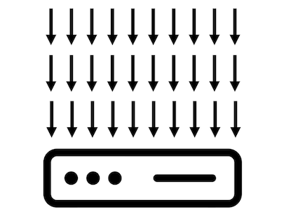

# The Problem with Blocking
* * *
Imagine you're the manager at a successful grocery store.

Suddenly, the number of people standing in the checkout lines starts to increase.

What would you do?

Probably the obvious choice is to open more checkout lanes (assuming there are more lanes or cashiers available).

Customers still have to wait, but the waiting time is reduced in proportion to the available checkouts.

In this regard, web applications are similar. They can serve many concurrent users, but after reaching a certain number of  users, the response time can increase drastically.

And that's because the way most applications work is by blocking requests.

Let me explain.

Traditionally, a server handles a request, or in practical terms, a user, using one thread.

The server maintains a pool of threads to serve requests.

If the pool size is 10, it means the server can handle 10 requests concurrently.

The eleventh request will have to wait until the server finishes processing one of the first ten requests.

In other words, the execution is blocked until a free thread can process the request.

Now imagine that our ten threads have to handle thirty requests.

The time it takes the server to process the request, the response time for the user, will increase.

Opening more checkouts in a grocery store would be the equivalent of adding more resources to our application. Resources such as threads, CPUs, servers, or containers.

But is adding more resources the best approach?

Well, not always.

What if the number of concurrent users keeps increasing until there are no more free threads?

Roughly speaking, at any given time, one CPU core can handle one thread ([multithreading](https://docs.oracle.com/cd/E19253-01/816-5137/mtintro-25092/index.html) is just the CPU switching execution between threads): 

But there are two more important things to consider.

One is memory.

Usually, the JVM implements Java threads as thin wrappers around operating system threads. They are called platform threads (there's another type of threads, virtual threads, [a preview feature of Java 19](https://openjdk.org/jeps/425)).

Each platform thread has its own stack space in memory that contains stack frames representing method calls, parameters, and other local variables.

If your application uses one thousand platform threads, and each thread’s stack size is one megabyte, the server will need around one gigabyte just for the threads, in addition to the heap memory.

If the thread pool grows to handle more requests, the memory consumption will increase accordingly.

So, when talking about **platform** threads (traditional, not virtual threads), this blocking approach can result in inefficient use of memory and CPU.

The second thing to consider is the time the server takes to communicate with a database or another system, for example.

Just like in a grocery store where people can take ages at checkout looking for their wallet or arguing about prices, your application might run into a query that takes too long to return information from the database.

If the program does nothing while waiting for the data, it's a waste of resources.

However, if you allow more requests to an already overloaded database, for example, the problem will only get worse.

The alternative is to make more efficient use of the resources.

What if instead of waiting for the data, our program could switch to another task, coming back later to the other request when the data is available?

The reactive paradigm allows us to do that. 

And in a simple way.
