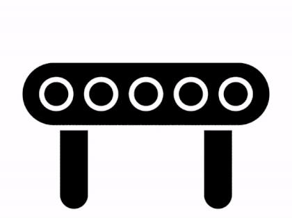
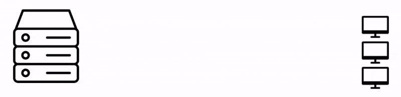

# What is Reactive Programming?
* * *
The word "Reactive" comes from the verb "react". Here are [two definitions that the dictionary provides for this word](https://www.dictionary.com/browse/react):
1. To act in response to an agent or influence.
2. To respond to a stimulus in a particular manner.

Okay, so reactive programming is about responding to something.

But to what?

And responding in what way?

Well, reactive programming is often compared to "programming a spreadsheet," where you set up values and relationships for those values.

For example, I can define cell B1 as the value of cell A1 plus two.

This way, every time I change the value of cell A1, the other cell reacts to that change.


And we can change it again.

And again.

And again.

Without doing anything else, B1 will always react to the values of A1.

The values these changes produce can be seen as a stream of data.

You can think of a stream as a sequence of data moving through an assembly line.


Something comes in, there's a transformation, and something else comes out.

Something comes in, something else comes out.

And so on.

Anything can be a stream of data.

Numbers, images, mouse clicks, anything can be streamed.



Now, you may have heard about the Stream API introduced in Java 8 and wonder, are we talking about the same streams?
```java
Stream.of(1, 2, 3, 4)
  .filter(i -> i > 2)
  .map(i -> i * 100)
  .forEach(System.out::println);
```

No, not really.

The main difference is that Java streams are pull-based, and reactive streams are push-based.

What does this mean?

Well, when you work with Java streams, they're usually based on a list or an array that exists in memory at that moment.


So, as every element already exists, the element is pulled from the source and transformed into something else.

On the other hand, a reactive stream is a sequence of data or events happening over time.


This means that data might not be available at the beginning, so it is not possible to just pull data from the source.

In some cases, we won't be able to know when the data or events might happen, so they will have to be pushed to the assembly line when available.


This fact changes everything, think about it.

We cannot make blocking calls because you don't know if the next element is going to arrive in the next second or the next minute. I mean, we cannot block a request for an undetermined amount of time while doing nothing.

We need to work asynchronously, in other words, we need a mechanism to make the request, possibly go work on something else, and have the system tell us when the work is done so we can finish the initial request.

Do you see the difference?

When you pull a result, you make a blocking, synchronous call, doing nothing else until you get the result.


When the result is pushed to you, you make a non-blocking, asynchronous call that allows you to do something else because you don't have to wait for the result. When the result is available, it is pushed to you.


That's why reactive programming is often compared with the Observer design pattern.

This pattern defines a provider or subject that sends notifications to one or more observers, the consumers of those events, when one is generated.



This is one way of solving the time issue of push streams.

However, what happens when the observers cannot keep up with all the events generated by the producer?


Neither this pattern nor Java streams provide a simple mechanism so we can signal the producer to send the events at a different rate.

But in reactive programming, there is a mechanism for this.

The ability of the consumer to request items at a different rate is called backpressure.

In this regard, we can also compare reactive programming with the Iterator design pattern.


In object-oriented programming, this pattern allows us to access the elements of a collection sequentially without needing to know its underlying representation, just by calling a `next()` method whenever we need an element.

With backpressure, we can say, for example, I can only process three elements at most at this time, so, if the elements are available, just sent me three, please. Of course, if the elements are not ready, they will get pushed whenever they are.


Finally, another aspect of reactive programming, is that the operations to transform the values have two traits.

The first one is that they are expressed declaratively rather than imperatively, in other words, we don't have to worry about how to implement the logic. We just need to express the logic of the transformation using operators such as `filter()` or `takeLast()`:
```java
Stream.of(1, 2, 3, 4)
  .filter(i -> i > 2)
  .map(i -> i * 100)
  .takeLast()
  .forEach(System.out::println);
```

And the second one, these operators don't modify the original stream, they create a new one with the transformation applied:
```java
Stream originalStream = Stream.of(1, 2, 3, 4);
  Stream filtered = originalStream.filter(i -> i > 2);
  Stream mapped = filtered.map(i -> i * 100);
  Stream lastElement = mapped.takeLast();
  lastElement.forEach(System.out::println);
```

From the perspective of functional programming, a programming paradigm that works with pure functions, the operators fulfill two conditions necessary to consider a function pure:
- Always return the same result for the given inputs, meaning that the result only depends upon the inputs passed.
- And do not have side effects, meaning that the function should not modify any state.

That's why reactive programming is sometimes called functional reactive programming.

So, reactive programming is non-blocking, asynchronous, and declarative/functional.

Let's talk a bit more about these traits.

