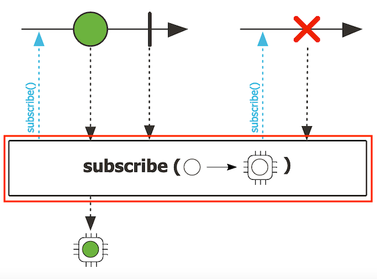

# Asynchronous Streams in Reactor
---
I've been talking about streaming elements of data (plural), but streaming just one element (or even an empty stream) can be helpful sometimes.

To make this cardinality distinction, in Reactor, we have a `Mono` object (or publisher) that streams zero or one element.


And a `Flux` object (or publisher), to stream from zero to any number of elements.


Of course, nothing stops us from always using `Flux`, since this object can stream zero or one element just like `Mono`.

But if we know in advance the number of elements of a stream, by using the appropiate object, you're automatically communicating the cardinality of that stream:
- `Mono<T>` represents a publisher of zero or one object of type `T`.
- `Flux<T>` represents a publisher of zero or N objects of type `T`.
    
If you know that a publisher will not emit a value, the convention is to represent this as `Mono<Void>` (don't worry, we'll review some examples later in the course).

Also, `Mono` and `Flux` work in different ways.

Since `Mono` objects emit at most one value, the method `onComplete()` is immediately called after `onNext(T)`.


For `Flux`, the method `onComplete()` is optional. Actually, all methods from the `Subscriber` are also optional for `Flux`:
- If `onNext(T)` is the only method ever called, the stream will be infinite.
- `onError(Throwable)` is called only when an error occurs.
- If only `onComplete()` is called, we'll have an empty stream.
- If neither `onNext(T)` nor `onComplete()` are called, we'll have an empty infinite stream.

Regarding operators, if they return a stream of zero or N elements, the result will be a `Flux`. For example, if you use the operator `concatWith` to concatenate two publishers, even if we're talking about two `Mono` publishers, the result will always be a `Flux`:
```java
Flux<T> concatWith(Publisher<? extends T> other)
```

Or, if the result is a stream of zero or one element, the operator will return a `Mono`. For example, the operator `count`, to count the number of elements in a stream, always returns a `Mono<Long>`:
```java
Mono<Long> count()
```
    
By the way, do you think the `count` operator makes sense in a `Mono` object?

No, it doesn't. 

`Mono` objects always contain one element, so `Mono` doesn't have a `count` operator. 

In general, `Mono` provides only a subset of the operators that are available for `Flux`.

[Here you can find the javadoc for Mono](https://projectreactor.io/docs/core/release/api/reactor/core/publisher/Mono.html).

[And here you can find the javadoc for Flux](https://projectreactor.io/docs/core/release/api/reactor/core/publisher/Flux.html).

The recommended way to learn about the API of these objects is through the reference documentation, rather than through the javadoc.

However, on the javadoc, you'll find the so called "marble diagrams" for all the operators available for `Mono` and `Flux`. These diagrams will help you understand how the operators work. Here's an example of [a marble diagram](https://projectreactor.io/docs/core/release/api/reactor/core/publisher/Mono.html#subscribe-java.util.function.Consumer-):


These horizontal lines represent the timeline of publisher. Time flows from left to right:


When an element is emitted by the publisher, this is represented by a circle:


A dotted line indicates that the element goes through a transformation (operator):


The text inside the box indicates the name of the operator and the transformation it applies:



Then, below the operator box, the result of the transformation appears (if any):


The vertical line indicates that the publisher has completed successfully:


But if the publisher throws an error, the vertical line is replaced by an X:


For `Flux`, the only difference is that there are more elements (circles) in the timeline:


All right, now let's see how to create `Mono` and `Flux` publishers.

