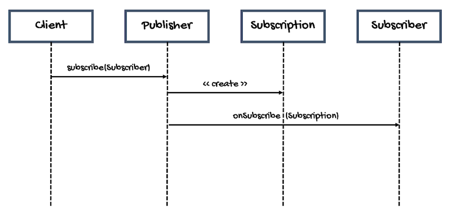

# Nothing Happens Until You Subscribe
---

If you run the examples we've reviewed so far, you'll see that the elements contained in the publishers are not printed (only a few messages to show you how eager creation works). We also didn't do anything with them.

We can add a lot of operators, there are a lot to choose from:
```java
Flux.just(1, 2, 3, 4, 5, 6, 7, 8, 9)
    .map(n -> n * 2)
    .skip(1)
    .count()
```

But the truth is that none of these operators will be executed until someone subscribes to the `Flux`.

Do you remember the diagram of how reactive streams work?



The call to the `subscribe` method in the `Publisher` interface is what triggers everything, the creation of the `Subscription` object so the client can request elements, the sending of those elements, etc.

From the [Reactor documentation](https://projectreactor.io/docs/core/release/reference/):
> Once you subscribe, a chain of Subscriber objects is created, backward (up the chain) to the first publisher. This is effectively hidden from you. All you can see is the outer layer of Flux (or Mono) and Subscription, but these intermediate operator-specific subscribers are where the real work happens.

So always remember:
> Nothing happens until you subscribe.

But, what are the options to subscribe to a `Publisher`?

In Reactor, we have many versions of the `subscribe` method for `Mono` and `Flush`.

For example, to subscribe to the publisher and request elements without limits:
```java
Disposable subscribe()
```

To subscribe to the publisher with a `Consumer` that will receive all the published elements:
```java
Disposable subscribe(Consumer<? super T> consumer)
```

To subscribe to the publisher with a `Consumer` that will receive all the published elements, as well as a `Consumer` that will handle errors:
```java
Disposable subscribe(
    Consumer<? super T> consumer, 
    Consumer<? super Throwable> errorConsumer
)
```

To subscribe to the publisher with a `Consumer` that will receive all the published elements, as well as a `Consumer` that will handle errors, and a `Runnable` that will be executed when the sequence completes:
```java
Disposable subscribe(
    Consumer<? super T> consumer, 
    Consumer<? super Throwable> errorConsumer, 
    Runnable completeConsumer
)
```

To subscribe to the publisher with a `Consumer` that will receive all the published elements, as well as a `Consumer` that will handle errors, a `Runnable` that will be executed when the sequence completes, and a `Context` object that will be tied to the subscription:
```java
Disposable subscribe(
    Consumer<? super T> consumer, 
    Consumer<? super Throwable> errorConsumer, 
    Runnable completeConsumer, Context initialContext
)
```

And to subscribe to the publisher with a `Subscriber` object to have more control over backpressure and the request:
```java
void subscribe(Subscriber<? super T> actual) 
```

[Disposable](https://projectreactor.io/docs/core/release/api/reactor/core/Disposable.html) is a functional interface that represents a task or resource that can be canceled or disposed:
```java
@FunctionalInterface
public interface Disposable {
    // Cancel or dispose the underlying task or resource.
    void dispose();

    // Optionally return true when the resource or task is disposed.
    default boolean isDisposed() {
        return false;
    }
    // ...
}
```

So, if we subscribe to the following `Mono` this way:
```java
Mono.just(1).subscribe();
```

The element it wraps will be published. However, it is not useful since we have no proof that this happened. 

Of course, there are ways to verify this. For example, in unit tests, we can use the interface [StepVerifier](https://projectreactor.io/docs/test/release/api/reactor/test/StepVerifier.html) (we'll cover this topic later in this course). 

In a web framework like [Spring WebFlux](https://docs.spring.io/spring-framework/docs/current/reference/html/web-reactive.html), the framework itself calls the `subscribe()` method at the appropriate point in the execution flow, you don't do it yourself. We know the code is executed because something is returned to the client or there are side-effects like saving something in a database.

But for the examples shown here, it's better to use the version that takes a [Consumer](https://docs.oracle.com/en/java/javase/17/docs/api/java.base/java/util/function/Consumer.html) and do something with the value it receives. Like printing it:
```java
Mono.just(1).subscribe(new Consumer<Integer>() {
    @Override
    public void accept(Integer integer) {
        System.out.println(integer);
    }
});
```

Of course, we can simplify the code with a lambda expression:
```java
Mono.just(1).subscribe(
    integer -> System.out.println(integer)
);
```

Or with a method reference:
```java
Mono.just(1).subscribe(System.out::println);
```

Other versions of `subscribe` allow you to get the exception thrown, if there's an error, by passing another `Consumer`. Take the following code as an example:
```java
private Integer getException() {
    return 1/0;
}
// ...
Mono.defer(() -> Mono.just(getException()))
    .subscribe(
            System.out::println,
            e -> System.out.println("Message: " + e.getMessage())
    );
```

The reason I'm using `Mono.defer` is because, this way, the exception will be thrown lazily, at subscription time. Otherwise, the exception will be thrown eagerly, when the `Mono` is created, without having a chance to subscribe to it.

You can also execute an action when all elements have been published (notice that the arguments are optional):
```java
Mono.just(1)
        .subscribe(
                null,
                null,
                () -> System.out.println("The end")
        );
```

However, something to be aware of is that [the version that takes an argument of type Consumer<? super Subscription>](https://projectreactor.io/docs/core/release/api/reactor/core/publisher/Flux.html#subscribe-java.util.function.Consumer-java.util.function.Consumer-java.lang.Runnable-java.util.function.Consumer-) is deprecated for `Flux` and it is removed in Reactor 3.5. This version was useful because, with the `Subscription` object, you can modify the amount of data the publisher sends (backpressure). Here's an example:
```java
Flux.just(1, 2, 3)
    .subscribe( // It's marked as deprecated
            System.out::println,
            null,
            null,
            s -> s.request(1)
    );
```

A good alternative for this is the more verbose `subscribe(Subscriber)` version. This would be the equivalent of the previous example:
```java
Flux.just(1, 2, 3)
    .subscribe(new BaseSubscriber<Integer>() {
        @Override
        protected void hookOnSubscribe(Subscription s) {
            s.request(1L);
        }

        @Override
        protected void hookOnNext(Integer value) {
            System.out.println(value);
        }
    });
```

The [BaseSubscriber](https://projectreactor.io/docs/core/release/api/reactor/core/publisher/BaseSubscriber.html) abstract class gives you more control by overriding some hooks (some are optional).

Like this optional hook, executed after any of the termination events (like `SignalType.ON_ERROR`, `SignalType.ON_COMPLETE`, `SignalType.CANCEL`, etc.):
```java
protected void hookFinally(SignalType type)
```

There's another optional hook executed when the subscription is cancelled by calling the `Subscriber`'s `cancel()` method:
```java
protected void hookOnCancel()
```

An optional hook for processing something on completion:
```java
protected void hookOnComplete()
```
    
Or this optional hook for error processing:
```java
protected void hookOnError(Throwable throwable)
```
    
There's also a hook for processing of `onNext` values:
```java
protected void hookOnNext(T value)
```
    
And this hook, for further processing `onSubscribe`'s `Subscription`:
```java
protected void hookOnSubscribe(Subscription subscription)
```

All right, now you're ready to start learning about operators.
