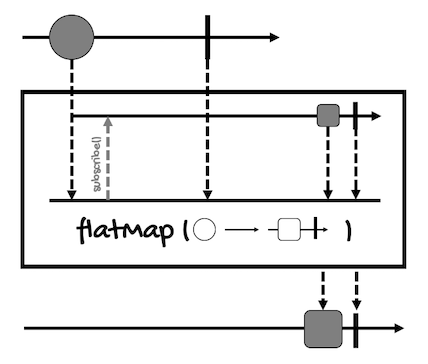
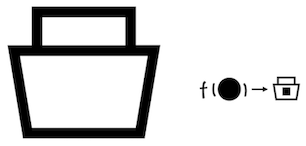
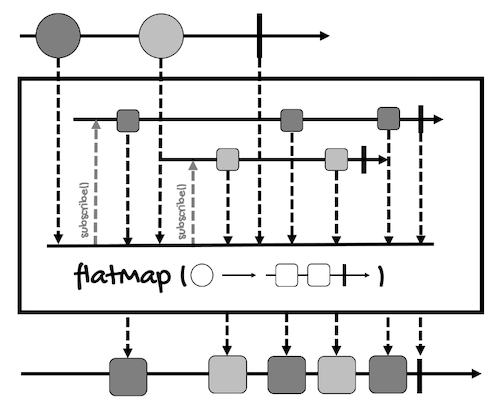

# The flatMap Operator
---

The `flatMap` operator transforms the elements emitted by a `Publisher` asynchronously by applying a function that returns the values emitted by inner publishers.

The main difference with the `map` operator is that the function passed to `flatMap` returns a `Publisher` implementation to transform the value(s) asynchronously.

However, `flatMap` behaves differently depending if we're working with `Mono` or with `Flux`.

Let's start with `Mono`'s version. Here's the [marble diagram for this operator](https://projectreactor.io/docs/core/release/api/reactor/core/publisher/Mono.html#flatMap-java.util.function.Function-):



1. First, a `Mono` of circles emits a circle.
2. Internally, `flatMap` subscribes to the `Mono` returned by the function.
3. This `Mono` will transform the circle to a square asynchronously and emit it.
4. Finally, the square is put into a new `Mono` (of squares) so it can be processed by another operator or sent to a subscriber.

Thinking in terms of containers, if you have a container with one circle:


The `flatMap` operator unpacks the circle:


To pass it to a function that converts it into a square asynchronously:



Since this is done asynchronously, the square is returned inside a new container (remember that the container represents an asynchronously type):


But instead of returning a container inside a container like the `map` operator would do:


`flatMap` flattens these containers into one:


So, up to this point, it's not much different from `map`, except for the returning type of the function.

However, with `Flux`, things are a bit more complicated.

Here's [the marble diagram for the `Flux` version of `flatMap`](https://projectreactor.io/docs/core/release/api/reactor/core/publisher/Flux.html#flatMap-java.util.function.Function-):



Let's review it step by step:
1. First, the `Flux` emits a circle (let's say the dark gray one).
2. Internally, `flatMap` creates a new publisher for that circle. Depending on the function passed to `flatMap`, this internal publisher can emit multiple elements (squares in this case), creating a one-to-many relationship. This means that one input element can be converted into many output elements.
3. When the new publisher is created, `flatMap` subscribes to it eagerly. In other words, `flatMap` subscribes to the publisher after it is created, it doesn't wait for the publishers of other elements to finish.
4. When the `Flux` emits another circle (the light gray one), steps 2 and 3 are repeated. This happens for all the circles the `Flux` emits.
5. In then end, `flatMap` will merge (flat) all the squares emitted by the internal publishers into a new `Flux` that can be processed by another operator or sent to a subscriber.

So there are three things that you have to take into account to understand the `flatMap` operator for `Flux`:
- There can be a one-to-many relationship between the elements of the input `Flux` and the elements of the output `Flux`. For every input element, `flatMap` will create an internal `Publisher`.
- This operator subscribes eagerly to its internal publishers.
- For this reason, each publisher can emit elements at a different time. Since the output elements will be merged as they arrived, there are no guarantees the original order will be preserved. In some cases, values from different inner publishers will be interleaved.

Here's the definition of `flatMap` for `Mono<T>`:
```java
public final <R> Mono<R> flatMap(Function<? super T, ? extends Mono<? extends R>> transformer)
```

And here's an example:
```java
Mono<Integer> monoInt = Mono.just(1);
Mono<String> monoFlat = monoInt
        .flatMap(i -> Mono.just("i: " + i));
// Remember, nothing happens until you subscribe
monoFlat.subscribe(System.out::println);
```

As you can see, for `Mono`, we use `flatMap` in the same way we use `map` (except for the use of an asynchronous function, of course).

The only thing to notice is that the function should always return a `Mono`, returning `Flux` will result in a compilation error.

On the other hand, here's the definition of `flatMap`  for `Flux<T>`:
```java
public final <R> Flux<R> flatMap(Function<? super T, ? extends Publisher<? extends R>> mapper)
```

In this case, the return type of the function is `Publisher`, so we have the option of returning either `Mono` or `Flux`.

Take for example the following code:
```java
Flux<Integer> fluxInt = Flux.just(1, 2, 3, 4);
Flux<Integer> fluxFlat = fluxInt
        .flatMap(i -> transformAsyncMono(i));
fluxFlat.subscribe(System.out::println);

// ...

public Mono<Integer> transformAsyncMono(int i) {
    return i % 2 == 0 ? Mono.just(i) : Mono.just(i * 10);
}
```

The function we're passing to `flatMap` returns a `Mono`, so the input and output streams will have a one-to-one mapping. Odd numbers will be multiplied by ten while even numbers won't be modified:
```
10
2
30
4
```

However, each of the elements emitted by a `Flux` may be transformed into multiple elements. 

For example, if the function we pass to `flatMap` returns a `Flux` for even numbers:
```java
Flux<Integer> fluxInt = Flux.just(1, 2, 3, 4);
Flux<Integer> fluxFlat = fluxInt
        .flatMap(i -> transformAsyncPublisher(i));
fluxFlat.subscribe(System.out::println);

// ...

public Publisher<Integer> transformAsyncPublisher(int i) {
    return i % 2 == 0 ? Flux.just(i, i+1) : Mono.just(i * 10);
}
```

`flatMap` will create two `Flux` streams, for the even numbers, and two `Mono` streams, for the odd numbers. This way, it will merge the four publishers. This will be the result:
```
10
2
3
30
4
5
```

In this case, we'll have a one-to-many relationship between the input and output streams.

However, you might be wondering, `flatMap` doesn't guarantee the order of the elements, but in the above examples, the elements kept the order of the input stream (1, 2, 3, 4).

Well, these examples are simple, we're not doing anything really asynchronous (remember, `just` works eagerly). But to show you that `flatMap` doesn't guarantee the order of the elements, let's use the operator `delayElements` to introduce a delay between the emission of the elements of the `Flux` for even numbers:
```java
Flux<Integer> fluxInt = Flux.just(1, 2, 3, 4);
Flux<Integer> fluxFlat = fluxInt
        .flatMap(i -> transformAsyncPublisherDelay(i));
fluxFlat.subscribe(System.out::println);

// ...

public Publisher<Integer> transformAsyncPublisherDelay(int i) {
    return i % 2 == 0 
            ? Flux.just(i, i+1)
                .delayElements(Duration.ofMillis(1)) 
            : Mono.just(i * 10);
}
```

This is the result:
```
10
30
2
4
3
5
```

As you can see, even a delay of one millisecond is enough to have the elements in a different order.

`Mono` and `Flux` have other versions of `flatMap`, for example, to preserve the order of the elements.

For `Mono`, we have a version that transforms the item emitted by a `Mono` into an `Iterable`, and then forwards the elements of this `Iterable` into the returned `Flux`:
```java
Flux<R> flatMapIterable(Function<? super T,? extends Iterable<? extends R>> mapper)
```

Another that transforms the item emitted by a `Mono` into a `Publisher` (most of the time a `Flux`), and then forwards the elements of this `Publisher` into the returned `Flux` (it works like `Flux`'s `flatMap`):
```java
Flux<R> flatMapMany(Function<? super T,? extends Publisher<? extends R>> mapper)
```

And one to transform the signals emitted by a `Mono` (`onNext`, `onError`, and `onComplete`) into signal-specific publishers, and then forwards the applicable `Publisher`'s emissions into the returned `Flux`:
```java
Flux<R> flatMapMany(
    Function<? super T,? extends Publisher<? extends R>> mapperOnNext, 
    Function<? super Throwable,? extends Publisher<? extends R>> mapperOnError, 
    Supplier<? extends Publisher<? extends R>> mapperOnComplete
)
```

Basically, these versions allow us to have a one-to-many relationship similar to the one we have with `Flux`'s `flatMap`.

For `Flux`, `flatMap` has many versions.

There's one to transform the signals emitted by this `Flux` (`onNext`, `onError`, and `onComplete`) into `Publishers`, then flatten these inner publishers into a single `Flux` through merging:
```java
Flux<R> flatMap(
    Function<? super T,? extends Publisher<? extends R>> mapperOnNext, 
    Function<? super Throwable,? extends Publisher<? extends R>> mapperOnError, 
    Supplier<? extends Publisher<? extends R>> mapperOnComplete
)
```

Another to transform the elements emitted by this `Flux` asynchronously into inner publishers and merge them into a single `Flux`, taking as parameter the maximum number of inner publishers:
```java
Flux<V> flatMap(
    Function<? super T,? extends Publisher<? extends V>> mapper, 
    int concurrency
)
```

Another to transform the elements emitted by this `Flux` asynchronously into inner publishers and merge them into a single `Flux`, taking the maximum number of inner publishers and the maximum of prefetch elements from each inner publisher:
```java
Flux<V> flatMap(
    Function<? super T,? extends Publisher<? extends V>> mapper, 
    int concurrency, 
    int prefetch
)
```   

Another to transform the elements emitted by this `Flux` asynchronously into inner publishers and merge them into a single `Flux`, taking the maximum number of inner publishers and the maximum of prefetch elements from each inner publisher. This variant will delay any error until after the rest of the `flatMap` backlog has been processed:
```java
Flux<V> flatMapDelayError(
    Function<? super T,? extends Publisher<? extends V>> mapper, 
    int concurrency, 
    int prefetch
)
```
    
Another to transform the items emitted by a `Flux` into `Iterable`s, then merge the elements from those into a single `Flux`:
```java
Flux<R> flatMapIterable(
    Function<? super T,? extends Iterable<? extends R>> mapper
)
```

Another to transform the items emitted by a `Flux` into `Iterable`s, then merge the elements from those into a single `Flux`, taking the number of values to request from the source upon subscription:
```java
Flux<R> flatMapIterable(
    Function<? super T,? extends Iterable<? extends R>> mapper, 
    int prefetch
)
```
    
Another to transform the elements emitted by a `Flux` into `Publisher`s, merging the inner publishers in the order of their source element:
```java
Flux<R> flatMapSequential(
    Function<? super T,? extends Publisher<? extends R>> mapper
)
```

Another to transform the elements emitted by a `Flux` into `Publisher`s, merging the inner publishers in the order of their source element, taking as parameter the maximum number of inner publishers:
```java
Flux<R> flatMapSequential(
    Function<? super T,? extends Publisher<? extends R>> mapper, 
    int maxConcurrency
)
```

Another to transform the elements emitted by a `Flux` into `Publisher`s, merging the inner publishers in the order of their source element, taking the maximum number of inner publishers and the maximum of prefetch elements from each inner publisher:
```java
Flux<R> flatMapSequential(
    Function<? super T,? extends Publisher<? extends R>> mapper, 
    int maxConcurrency, 
    int prefetch
)
```

And one to transform the elements emitted by a `Flux` into `Publisher`s, merging the inner publishers in the order of their source element, taking the maximum number of inner publishers, and the maximum of prefetch elements from each inner publisher. This variant will delay any error until after the rest of the `flatMap` backlog has been processed:
```java
Flux<R> flatMapSequentialDelayError(
    Function<? super T,? extends Publisher<? extends R>> mapper, 
    int maxConcurrency, 
    int prefetch
)
```

There are two things I want to highlight about all these versions.

One is that if you want to preserve the order of the source publisher, you have to use `flatMapSequential`. For example:
```java
Flux<Integer> fluxInt = Flux.just(1, 2, 3, 4);
Flux<Integer> fluxFlat = 
    fluxInt
        .flatMapSequential(i -> transformAsyncPublisherDelay(i));
fluxFlat.subscribe(System.out::println);
```

Using `flatMapSequential`, even with the method that adds a delay of one millisecond, will output the elements in order:
```
10
2
3
30
4
5
```

And two. Some versions take a `concurrency` and a `prefetch` argument to manage backpressure. 

The `concurrency` argument controls how many inner publishers can be subscribed to and merged in parallel. For example, with a `Flux` of four elements, a concurrency of 2 means `flatMap` will make two requests to the `Flux`.

The `prefetch` argument is the number of elements requested to each inner publisher in each batch of requests. For example, with a prefetch of 2, after the inner publishers have emitted two elements, the next batch (of two) will be requested.

If you want to know more about these arguments, [here's an excellent article with more information and examples](https://pandepra.medium.com/project-reactors-flatMap-and-backpressure-fba97472d625).

All right, now let me give you some pointers about when to use `map` and `flatMap`.

