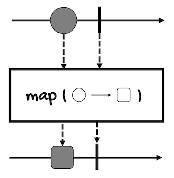
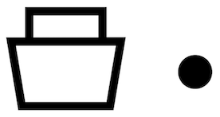
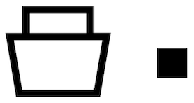

# The map Operator
---

The `map` operator transforms the elements emitted by a `Publisher` by applying a function to each of them.

Here's the marble diagram of this operator (for [Mono](https://projectreactor.io/docs/core/release/api/reactor/core/publisher/Mono.html#map-java.util.function.Function-)):



1. First, a `Publisher` of circles emits a circle.
2. Then, the circle is transformed into a square by the operation passed to the `map` operator.
3. Finally, the square is put into a new `Publisher` (of squares) so it can be processed by another operator or sent to a subscriber.

Thinking in terms of containers, if you have a container of circles:


The `map` operator unpacks the circle:



Converts it into a square:



And packs the square in a new container:


Here's the definition of `map` for `Mono<T>` and `Flux<T>`:
```java
// For Mono
public final <R> Mono<R> map(
    Function<? super T,? extends R> mapper
)
// For Flux
public final <V> Flux<V> map(
    Function<? super T,? extends V> mapper
)
```

For example, if we have a `Mono` of `String` that we want to convert into a `Mono` of `LocalDate`:
- `T` would be `String`
- `R` (`V` in the case of `Flux`) would be `LocalDate`

We'll need a `Function` of type `Function<String, LocalDate>` to make the conversion. For example:
```java
Function<String, LocalDate> stringToDateFunction = s -> 
    LocalDate.parse(
        s, 
        DateTimeFormatter.ofPattern(
            "yyyy-MM-dd", 
            Locale.ENGLISH
        )
);
```

This way, we can use the function with the `map` operator to transform a `Mono<String>` to a `Mono<LocalDate>`:
```java
Mono<String> monoString = Mono.just("2022-01-01");
Mono<LocalDate> monoDate = monoString.map(stringToDateFunction);

monoDate.subscribe(d -> 
    System.out.println(
        d.format(
            DateTimeFormatter.ofLocalizedDate(FormatStyle.LONG)
        )
    )
);
```

For `Flux`, we can use the same function, there are no differences:
```java
Flux<String> fluxString = Flux.just(
    "2022-01-02", "2022-01-03", "2022-01-04"
);
Flux<LocalDate> fluxDate = fluxString.map(stringToDateFunction);

fluxDate.subscribe(d -> 
    System.out.println(
        d.format(
            DateTimeFormatter.ofLocalizedDate(FormatStyle.LONG)
        )
    )
);
```

Notice two things.

One. `map` passes the emitted value to the function, it doesn't pass the whole `Mono` or `Flux` object. 

So, since we're not required to work with asynchronous types, just with plain types, it is said that `map` works with synchronous functions. You don't need to perform asynchronous operations inside these functions.

This doesn't mean that you can perform blocking operations (like a database query) inside these functions. Well, technically you can, but this defeats the purpose of reactive programming.

However, you can use imperative programming inside the function if you want:
```java
Function<String, Date> stringToDateImperativeFunction = s -> {
    if(s != null && s.contains("-")) {
        return LocalDate.parse(
                    s, 
                    DateTimeFormatter.ofPattern(
                        "yyyy-MM-dd", 
                        Locale.ENGLISH
                    )
        );
    } else {
        return LocalDate.now();
    }
};
Mono<String> monoString = Mono.just("2022-01-05");
Mono<LocalDate> monoDate = monoString.map(stringToDateImperativeFunction);

monoDate.subscribe(d -> System.out.println(
        d.format(DateTimeFormatter.ofLocalizedDate(FormatStyle.LONG))));
```

Simple logic like the above can be replaced by operators that we'll review later, but, for example, if your logic involves complex branching or loops and you think imperative programming adds more clarity to the code, you can use it without problems.

And two. The values returned by the `map` function will be wrapped inside a new `Publisher`. 

If the `Function` returns an `Integer`, you'll have a `Mono` or `Flux` of type `Integer`:
```java
Mono<Integer> monoInteger = Mono.just(1)
    .map(i -> i * 2);

monoInteger.subscribe(System.out::println);
```

If the `Function` returns a list of `Integer`, you'll have a `Mono` or `Flux` of type `List<Integer>`:
```java
Mono<List<Integer>> monoListInteger = Mono.just(1)
    .map(i -> Arrays.asList(1));

monoListInteger.subscribe(System.out::println);
```

See the problem?

You'll have a container **inside** another container.

This can be a problem because sometimes you'll have methods that will return container types such as `List` or even asynchronous types like `Mono` and `Flux`, and then you'll want to perform another operation on the value, not on the container (`Mono` or `Flux`):
```java
Mono.just(1)
    .map(i -> asyncTransformation(i))
    .map(j -> j * 10)  // Compiler error, 
                       // the type of j is Mono<Integer>
;

// ...
Mono<Integer> asyncTransformation(int i) {
    // Modify i in some way
    return Mono.just(i);
}
```

In the above example, the first `map` operator will put in a `Mono` the returned value of the `asyncTransformation(int)` method. This way, you'll have a `Mono` inside another `Mono`, a `Mono<Mono<Integer>>`.

The second `map` operator will unpack the value of that `Mono` so the function it takes can receive an argument of type `Mono<Integer>`, not `Integer`.

To solve this problem, we have the `flatMap` operator.
