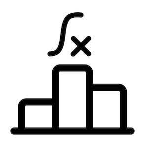
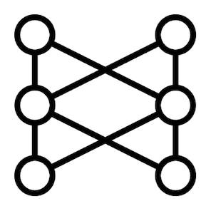

# Operators to Transform Sequences
---

You've learned about the implementations of the standard `Publisher` interface and how to subscribe to them.

Now, it's time to explore the operators offered by Reactor to work with reactive sequences represented by these implementations.

This module covers two operators that perform the most important operation in reactive programming, transformation. In the next module, we'll talk about other operators and operations.

All right.

Maybe you've heard about the map-reduce programming model. It's a popular model in the big data processing world.

Given a list of values, this model consists of two steps:
1. Produce a new list of values by applying an operation to each value of the original list.
2. Combine the values of that new list into a single one by applying the same computation to each value.

However, it turns out that this operation is so common in programming that map-reduce can be considered a pattern. Here's an example in traditional (imperative) programming showing the two operations:
```java
List<Integer> originalValues = Arrays.asList(1, 2, 3, 4, 5, 6);
List<Integer> newValues = new ArrayList();
int total = 0;
for(Integer val : originalValues) { // The map operation
    newValues.add(val * 2);
}
for(Integer val : newValues) {      // The reduce operation
    total += val;
}
System.out.println(total);
```

It's also common to filter the elements in some way, that's why this model/pattern is also known as map-filter-reduce:
```java
List<Integer> originalValues = Arrays.asList(1, 2, 3, 4, 5, 6);
List<Integer> newValues = new ArrayList();
int total = 0;
for(Integer val : originalValues) { // The map operation
    if(val % 2 == 0) {              // The filter operation
        newValues.add(val * 2);
    }
}
for(Integer val : newValues) {      // The reduce operation
    total += val;
}
System.out.println(total);
```

Why is this important?

Well, map-reduce has its roots in functional programming.

A [(pure) function](https://en.wikipedia.org/wiki/Functional_programming#Pure_functions) is just a method that has no side effects. Given the same arguments, the function will always return the same result without modifying anything outside its environment.

In functional programming, functions are first-class citizens. This means that functions can be assigned to variables, passed as arguments of other functions, chained or combined, etc.



Reactive programming uses a functional/declarative style to describe the steps that a reactive sequence goes through because the way you work with operators is by passing functions, represented by functional interfaces such as:
- [Function](https://docs.oracle.com/en/java/javase/17/docs/api/java.base/java/util/function/Function.html)
- [Predicate](https://docs.oracle.com/en/java/javase/17/docs/api/java.base/java/util/function/Predicate.html)
- [Consumer](https://docs.oracle.com/en/java/javase/17/docs/api/java.base/java/util/function/Consumer.html)
- [Supplier](https://docs.oracle.com/en/java/javase/17/docs/api/java.base/java/util/function/Supplier.html)

Take for example the Java stream version of map-filter-reduce that also uses functional interfaces:
```java
List<Integer> originalValues = Arrays.asList(1, 2, 3, 4, 5, 6);
int total = originalValues.stream()
    .map(val -> val * 2)
    .filter(val -> val % 2 == 0)
    .reduce(0, Integer::sum)
System.out.println(total);
```

As you can see, it works at a higher level of abstraction than the previous examples. The control statements (`for` and `if`) are gone and we only work with operators and functions.

Of course, you've learned that Java streams and reactive streams are not the same, but we cannot deny that the programming model is almost the same.

In Reactor, there's also a `map` operator that works like the Stream API's version, but since we're working with reactive streams, there's another version that works with `Publisher` interfaces, `flatMap`.

By the way, do you know why these transforming operators are called *map*?

Well, the term is related to mathematics, but in simple terms is because, with this operator, you can *map* an operation to every element of the input list to produce an output list. This way, there's a one-to-one *mapping* between the input sequence and the output.



Read [this article](https://dev.to/techgirl1908/why-is-map-called-map-2l03) (and the comments section) for more information.

All right, as I said before, I'll talk about `reduce` and other operators in the next module. For now, let's talk about the `map` operator.

