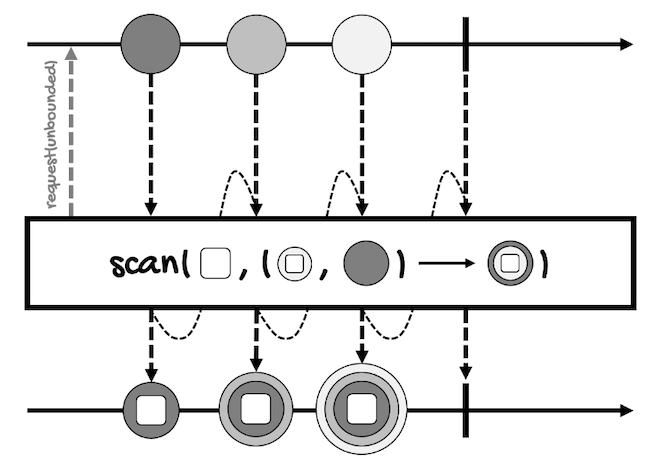

# Aggregating a Flux
---
Do you remember the map-filter-reduce pattern/model?

Well, we have talked about the `map`, `filter`, and other related operators. Now it's time to talk about `reduce`.

Reduce is an aggregation operation. An aggregation operation groups a collection of values to compute a single value.

In this lesson, we'll review the following aggregation operators:
- [reduce](#reduce)
- [scan](#scan)
- [collect](#collect)
- [hasElement(s)/all/any](#haselementsallany)
- [count](#count)

These operators are only available for `Flux`. Think about it, do they make sense for `Mono`?

## reduce
As the name implies, this operator reduces the values of a `Flux` into a single object.

There are three versions of `reduce`:
```java
Mono<A> reduce(
    A initial, 
    BiFunction<A,? super T,A> accumulator
)

Mono<T> reduce(
    BiFunction<T,T,T> aggregator
)

Mono<A> reduceWith(
    Supplier<A> initial, 
    BiFunction<A,? super T,A> accumulator
)
```

The first version takes the initial value that will be passed to the `BiFunction`, the function in charge of computing the single value, along with the first value of the `Flux`. This will return an intermediary value that will be passed along to the `BiFunction` with the next value of the `Flux` and so on.

In any case, notice two things:
- The value returned by the `reduce` operator is wrapped in a `Mono`.
- The type of the initial value (for the versions that take an initial value) is represented by `A`. The returned `Mono` also has a type `A`, which means that the reduce function can convert the elements from type `T` to type `A`.

For instance, this is the [marble diagram for the version that provides an initial value](https://projectreactor.io/docs/core/release/api/reactor/core/publisher/Flux.html#reduce-A-java.util.function.BiFunction-):


Here's an example where the reducing function adds all the elements of a `Flux` of integers:
```java
Flux<Integer> integerFlux = 
    Flux.just(1, 2, 3);

integerFlux
    .reduce(10, (a, b) -> {
        int result = a + b;
        System.out.format(
            "[%d + %d] = %d\n", a, b, result
        );
        return result;
    })
    .subscribe(System.out::println);
}
``` 

Of course, the reducing function could be as simple as `(a, b) -> a + b`, but in the example, I've added a statement to print the values of the arguments so you can see all the operations performed by the function.

Here's the result:
```
[10 + 1] = 11
[11 + 2] = 13
[13 + 3] = 16
16
```

Our initial value is `10`, so the first operation is `10 + 1`. The result, `11`, is carried over to the next iteration.

This way, the function receives `11` and `2`, returning `13` as the result.

Finally, the function receives `13` and `3`, which gives us the final result, `16`.

To try the second version of the `reduce` operator, we just need to remove the first argument:
```java
Flux<Integer> integerFlux = 
    Flux.just(1, 2, 3);

integerFlux
    .reduce((a, b) -> {
        int result = a + b;
        System.out.format(
            "[%d + %d] = %d\n", a, b, result
        );
        return result;
    })
    .subscribe(System.out::println);
}
``` 

Since we don't have an initial value to work with, the first two elements of the `Flux` will be passed to the function.

Here's the result:
```
[1 + 2] = 3
[3 + 3] = 6
6
```

Finally, for the third version, `reduceWith`, we can wrap the initial value in a [Supplier](https://docs.oracle.com/en/java/javase/17/docs/api/java.base/java/util/function/Supplier.html), which will be  called on subscription and passed to the the `BiFunction`.

Here's the first example modified to use `reduceWith`:
```java
Flux<Integer> integerFlux = 
    Flux.just(1, 2, 3);

integerFlux
    .reduceWith(() -> 10, (a, b) -> {
        int result = a + b;
        System.out.format(
            "[%d + %d] = %d\n", a, b, result
        );
        return result;
    })
    .subscribe(System.out::println);
```

The result will be the same:
```
[10 + 1] = 11
[11 + 2] = 13
[13 + 3] = 16
16
```

## scan
This operator works the same as `reduce`. Actually, all versions of `scan` are identical to the versions of `reduce`:
```java
Flux<A> scan(
    A initial, 
    BiFunction<A,? super T,A> accumulator
)

Flux<T> scan(
    BiFunction<T,T,T> accumulator
)

Flux<A> scanWith(
    Supplier<A> initial, 
    BiFunction<A,? super T,A> accumulator
)
```

The only difference is that `scan` emits each intermediary value.

For instance, this is the [marble diagram for the version that provides an initial value](https://projectreactor.io/docs/core/release/api/reactor/core/publisher/Flux.html#scan-A-java.util.function.BiFunction-):



Here's an example for the version that takes an initial value:
```java
Flux<Integer> integerFlux = 
    Flux.just(1, 2, 3);

integerFlux
    .scan(10, (a, b) -> a + b)
    .subscribe(System.out::println);
``` 

This is the result:
``` 
10
11
13
16
``` 

Here's the example for the second version:
```java
Flux<Integer> integerFlux = 
    Flux.just(1, 2, 3);

integerFlux
    .scan((a, b) -> a + b)
    .subscribe(System.out::println);
``` 

This is the result:
``` 
1
3
6
``` 

And for `scanWith`:
```java
Flux<Integer> integerFlux = 
    Flux.just(1, 2, 3);

integerFlux
    .scanWith(() -> 10, (a, b) -> a + b)
    .subscribe(System.out::println);
``` 

This is the result:
``` 
10
11
13
16
```

## collect
`collect*` operators allow you to *collect* all the elements of a `Flux` in a container, which can be a [List](https://docs.oracle.com/en/java/javase/17/docs/api/java.base/java/util/List.html), a [Map](https://docs.oracle.com/en/java/javase/17/docs/api/java.base/java/util/Map.html), or another one implementing the [Collector<T,A,R>](https://docs.oracle.com/javase/8/docs/api/java/util/stream/Collector.html) interface.

Here are some examples of the available `collect*` operators.

This one collects all elements of the `Flux` into a container using the `Collector` Java 8 Stream API:
```java
Mono<R> collect(
    Collector<? super T,A,? extends R> collector
)
``` 

This one collects all elements of the `Flux` into a `List`:
```java
Mono<List<T>> collectList()
``` 

The following collects all elements of the `Flux` into a `Map`. The key is extracted from each element by applying the `keyExtractor` function, the value is extracted by the `valueExtractor` function, and if several elements map to the same key, the associated value will be the most recent element:
```java
Mono<Map<K,V>> collectMap(
    Function<? super T,? extends K> keyExtractor, 
    Function<? super T,? extends V> valueExtractor
)
``` 

The following collects all elements of the `Flux` into a `Map` of key-`List` pairs. The key is extracted from each element by applying the `keyExtractor` function, the value is extracted by the `valueExtractor` function, and every element mapping to the same key is stored in the `List` associated to that key:
```java
Mono<Map<K,Collection<V>>> collectMultimap(
    Function<? super T,? extends K> keyExtractor,
    Function<? super T,? extends V> valueExtractor
)
``` 

And this one collects all elements of the `Flux` until it completes, and then sort them using the provided `Comparator` into a `List`:
```java
Mono<List<T>> collectSortedList(
    @Nullable Comparator<? super T> comparator
)
``` 

All these operators generate an empty container if the source `Flux` is empty.

For instance, this is the [marble diagram for the version `collect(Collector<? super T,A,? extends R> collector)`](https://projectreactor.io/docs/core/release/api/reactor/core/publisher/Flux.html#collect-java.util.stream.Collector-):


Let's review a few examples, so I can show you how to use `collectMap`, `collectMultimap`, and `collectSortedList`.

For `collectMap`, the next example uses the version that takes a key and a value extractor:
```java
Flux<Integer> integerFlux = 
    Flux.just(11, 22, 33, 34);

Mono<Map<Integer, Integer>> monoMap = 
    integerFlux.collectMap(
                i -> i / 10,
                i -> i % 10
    );

monoMap.subscribe(System.out::println);
```

As the key, `monoMap` uses the tens part of each element. As the value, `monoMap` uses the remainder when we divide the value by ten. 

This is the result:
```
{1=1, 2=2, 3=4}
``` 

Notice that the third element (`33`) was replaced by the last one (`34`). Remember, if many elements map to the same key, the associated value will be the most recently emitted element.

If we don't want this behavior, we have to use `collectMultimap`:
```java
Flux<Integer> integerFlux = 
    Flux.just(11, 22, 33, 34);

Mono<Map<Integer, Collection<Integer>>> monoMap =
    integerFlux.collectMultimap(
            i -> i / 10,
            i -> i % 10
    );

monoMap.subscribe(System.out::println);
```

In this case, the map contains a collection to preserve all the elements that map to the same key:
```
{1=[1], 2=[2], 3=[3, 4]}
```

We can use `collectSortedList` to sort the elements of the `Flux`.

The following example sorts the elements in reverse order:
```java
Flux<Integer> integerFlux = 
    Flux.just(1, 2, 3);

Mono<List<Integer>> monoSortedList =
    integerFlux.collectSortedList(
            Comparator.reverseOrder()
    );

monoSortedList.subscribe(System.out::println);
``` 

This is the result:
```
[3, 2, 1]
```

Finally, notice that all these operators return the container inside of a `Mono`, meaning that, even though `List` or `Map` are not asynchronous types, the collection process is done asynchronously.

## hasElement(s)/all/any
These operators can be considered aggregation operations because they reduce the value of a sequence to a `boolean` value.

Here are the definitions of these operators.

For `Mono`, `hasElement` emits a single `boolean` value that indicates if the `Mono` has an element:
```java
Mono<Boolean> hasElement()
``` 

It's the only operator in this lesson that is available for `Mono`.

For `Flux`, we have a `hasElement` operator that emits a single `boolean` value that indicates if any of the elements of the `Flux` is equal to the provided value:
```java
Mono<Boolean> hasElement(T value)
``` 

And a `hasElements` operator that emits a single `boolean` value that indicates if the `Flux` has, at least, one element:
```java
Mono<Boolean> hasElements()
``` 

As well as an `all` operator that emits a single `boolean` value if all values of the `Flux` match the predicate:
```java
Mono<Boolean> all(Predicate<? super T> predicate)
``` 

And an `any` operator that emits a single `boolean` value if any of the values of the `Flux` match the predicate:
```java
Mono<Boolean> any(Predicate<? super T> predicate)
``` 

Notice that all these operators return the `boolean` value wrapped in a `Mono`.

This is the [marble diagram of this operator](https://projectreactor.io/docs/core/release/api/reactor/core/publisher/Mono.html#hasElement--) (for `Mono`):


Here's an example that prints `false`:
```java
Mono<Integer> integerMono = 
    Mono.just(1);

integerMono
    .filter(i -> i > 1)
    .hasElement()
    .subscribe(System.out::println);
```

The `Flux` equivalent takes the value to test if any of the elements is equal to it:
```java
Flux<Integer> integerFlux = 
    Flux.just(1, 2, 3);

integerFlux
    .filter(i -> i > 2)
    .hasElement(3)
    .subscribe(System.out::println);
```

The above example only filters out the first two elements so `hasElement(3)` returns `true`.

On the other hand, `hasElements` (only available for `Flux`), returns `true` if the `Flux` has, at least, one element, like in the following example:
```java
Flux<Integer> integerFlux = 
    Flux.just(1, 2, 3);

integerFlux
    .filter(i -> i > 2)
    .hasElements()
    .subscribe(System.out::println);
```

Now, if you want to test, for example, if *all* the elements of a `Flux` are even, you can use the `all` operator:
```java
Flux<Integer> integerFlux = 
    Flux.just(1, 2, 3);

integerFlux
    .filter(i -> i > 2)
    .hasElements()
    .subscribe(System.out::println);
```

In this case, the result  is `false`.

And if you want to test, for example, if at least one value is even, use the `any` operator:
```java
Flux<Integer> integerFlux = 
    Flux.just(1, 2, 3);

integerFlux
    .any(i -> i % 2 == 0)
    .subscribe(System.out::println);
```

The result will be `true`.

## count
Finally, one the easiest operators for `Flux` you'll ever find:
```java
Mono<Long> count()
``` 

This operator counts the number of values in a `Flux`.

This is the [marble diagram for this operator](https://projectreactor.io/docs/core/release/api/reactor/core/publisher/Flux.html#count--):


Here's an example:
```java
Flux<Integer> integerFlux = 
    Flux.just(1, 2, 3, 4, 5);

Mono<Long> integerMono = integerFlux.count();
integerMono.subscribe(System.out::println);
```

The value is wrapped in a `Mono<Long>`, however, the output shouldn't be a surprise:
```
5
```
