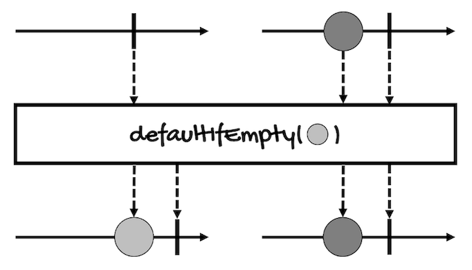
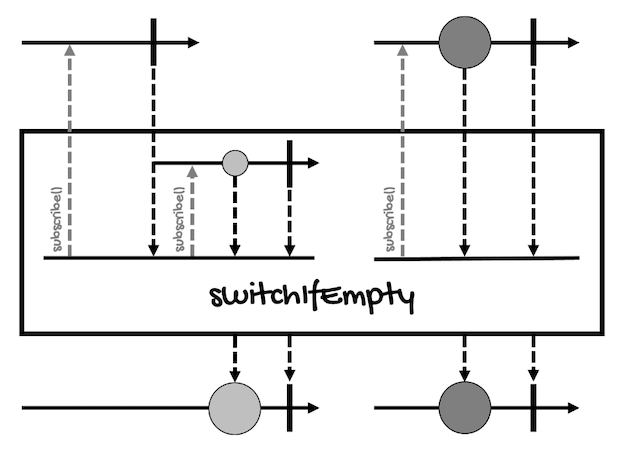

# Branching on Empty Sequences
---

In previous modules and lessons, I mentioned that in some cases, an `if` statement inside a `map` or `flatMap` operator can be replaced by another operator. 

Well, in addition to filter and other operators that can include or exclude elements based on condition (`Predicate`), another popular conditional operation is to return something else when a sequence/stream/collection is empty.

For this, there are two operators that can help us:
- [defaultIfEmpty](#defaultifempty)
- [switchIfEmpty](#switchifempty)

## defaultIfEmpty
This operator returns the provided single value if the sequence is empty or completes without values:
```java
// For Mono
Mono<T> defaultIfEmpty(T defaultV)

// For Flux
Flux<T> defaultIfEmpty(T defaultV)
``` 

Notice this operator returns the value wrapped in either a `Mono` or a `Flux` (depending on the `Publisher` we're using).

This is the marble diagram of this operator (it's the same for [`Mono`](https://projectreactor.io/docs/core/release/api/reactor/core/publisher/Mono.html#defaultIfEmpty-T-) and [`Flux`](https://projectreactor.io/docs/core/release/api/reactor/core/publisher/Flux.html#defaultIfEmpty-T-)):



Here's an example:
```java
Flux<Integer> integerFlux = 
    Flux.just(1, 2, 3, 4, 5);

integerFlux
    .filter(i -> i > 10)
    .defaultIfEmpty(-1)
    .subscribe(System.out::println);
```

This is the result:
```
-1
```

The predicate of the `filter` operator will evaluate to `false` for all the elements, so it will return an empty `Flux`. This way, the `defaultIfEmpty` operator will provide an alternative value wrapped in a `Flux` (`-1`), which will be published at the end.

If we change the predicate so at least one element evaluates to `true`:
```java
Flux<Integer> integerFlux = 
    Flux.just(1, 2, 3, 4, 5);

integerFlux
    .filter(i -> i > 4)
    .defaultIfEmpty(-1)
    .subscribe(System.out::println);
```

`defaultIfEmpty` won't change the `Flux` that `filter` returns. 

Here's the result of the above example:
```
5
```


## switchIfEmpty
This operator *switches* to the given `Publisher` if the sequence is empty or completes without values:
```java
// For Mono
Mono<T> switchIfEmpty(
    Mono<? extends T> alternate
)

// For Flux
Flux<T> switchIfEmpty(
    Publisher<? extends T> alternate
)
``` 

`switchIfEmpty` is to `defaultIfEmpty` just as `flatMap` is to `map` because it takes a `Publisher` as argument instead of a simple value.

For instance, this is the [marble diagram of this operator for `Mono`](https://projectreactor.io/docs/core/release/api/reactor/core/publisher/Mono.html#switchIfEmpty-reactor.core.publisher.Mono-):



Here's an example:
```java
Flux<Integer> integerFlux = 
    Flux.just(1, 2, 3, 4, 5);

integerFlux
    .filter(i -> i > 10)
    .switchIfEmpty(Flux.just(-1, 0, 99))
    .subscribe(System.out::println);
```

This is the result:
```
-1
0
99
```

If we change the predicate so at least one element evaluates to `true`:
```java
Flux<Integer> integerFlux = 
    Flux.just(1, 2, 3, 4, 5);

integerFlux
    .filter(i -> i > 4)
    .switchIfEmpty(Flux.just(-1, 0, 99))
    .subscribe(System.out::println);
```

`switchIfEmpty` won't switch to the alternative `Flux` it provides. 

Here's the result of the above example:
```
5
```
