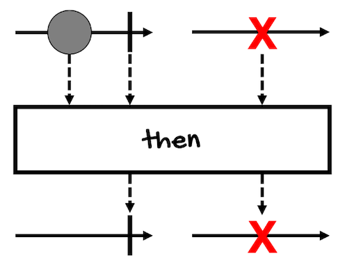
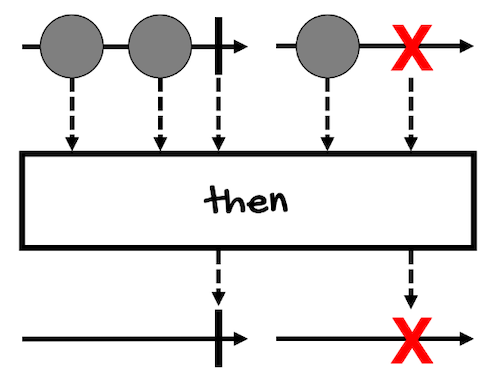
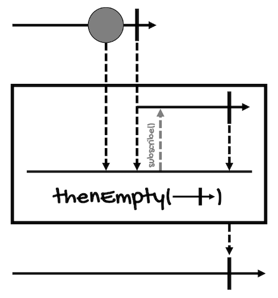
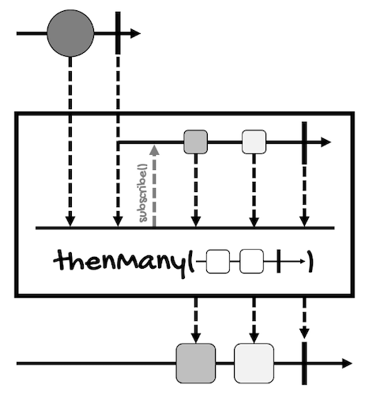
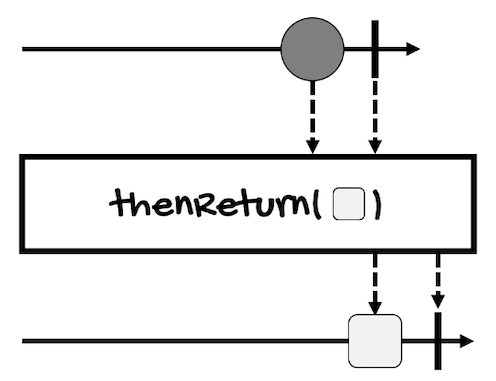

# Combining Actions
---

In the previous lesson, you learned how to combine sequences that contain values like integers and strings. However, `Mono` and `Flux` can also contain tasks or actions (of type `Runnable`, for example).

In this lesson, we're going to review the following operators:
- [then](#then)
- [thenEmpty](#thenempty)
- [thenMany](#thenmany)
- [thenReturn](#thenreturn)

## then
In general, `then*` operators allow you to execute or play a sequence and *then* chain another one to execute it after the previous sequence completes.

You can chain many sequences together, however, at the end, only the values of the last one will be returned to the subscriber. That's why most of the time, these operators are used for executing actions or tasks that don't return a value or when you're not interested in it.

In the case of `then`, this operator has two versions, one that doesn't take an argument, and one that does:
```java
// For Mono
Mono<Void> then()
Mono<V> then(Mono<V> other)

// For Flux
Mono<Void> then()
Mono<V> then(Mono<V> other)
``` 

Here's the [marble diagram for the version that doesn't take an argument, for `Mono`](https://projectreactor.io/docs/core/release/api/reactor/core/publisher/Mono.html#then--):



It returns a `Mono<Void>`, in other words, just the completion signal, when the `Mono` on which the operator is called completes.

Error signals are propagated too. Actually, all `then*` operators propagate errors, even if this is not shown in their marble diagrams.

This is the [marble diagram for `Flux`](https://projectreactor.io/docs/core/release/api/reactor/core/publisher/Flux.html#then--):



`Mono` only works with one element, but it's basically the same, `then` lets the sequence to complete or propagates the error if one happens at any point. 

However, notice that all the elements of the first `Mono` or `Flux` are discarded.

Here's an example:
```java
Mono<Integer> monoInt = Mono.fromCallable(() -> {
    System.out.println("Executing from monoInt...");
    return 1;
});

monoInt.then().subscribe(System.out::println);
```

This is the result:
```
Executing from monoInt...
```

As you can see, the print statement of `monoInt` is executed but the value the `Mono` contains (`1`) is not printed (it's not propagated to the subscriber).

On the other hand, the version of `then` that takes another `Mono` will emit this other `Mono` after the completion of the source publisher.

Here's an example:
```java
Mono<Integer> monoInt = Mono.fromCallable(() -> {
    System.out.println("Executing from monoInt...");
    return 1;
});
Mono<String> monoString = Mono.fromCallable(() -> {
    System.out.println("Executing from monoString...");
    return "a";
});

monoInt.then(monoString).subscribe(System.out::println);
```

This is the result:
```
Executing from monoInt...
Executing from monoString...
a
```

You can see that both `Mono`s were executed, but while the value of `monoInt` was discarded, the value of the provided `Mono` (`monoString`) was propagated to the subscriber.

## thenEmpty
You can think of `thenEmpty` as a special case of `then(Mono<V>)`. Instead of allowing a `Mono` of any type (`V`), this operator only allows an argument of type `Publisher<Void>`, returning a `Mono<Void>`:
```java
// For Mono
Mono<Void> thenEmpty(Publisher<Void> other)

// For Flux
Mono<Void> thenEmpty(Publisher<Void> other)
```

This way, this operator waits for the `Mono` to complete, and then, for the supplied `Publisher<Void>` (either a `Mono<Void>` or a `Flux<Void>`) to also complete.

Take a look at the [marble diagram of this operator for `Mono`](https://projectreactor.io/docs/core/release/api/reactor/core/publisher/Mono.html#thenEmpty-org.reactivestreams.Publisher-):



Here's an example:
```java
Mono<Integer> monoInt = Mono.fromCallable(() -> {
    System.out.println("Executing from monoInt...");
    return 1;
});
Mono<String> monoString = Mono.fromCallable(() -> {
    System.out.println("Executing from monoString...");
    return "a";
});
Mono<Void> monoVoid = Mono.fromRunnable(() -> {
    System.out.println("Executing from monoVoid...");
});

monoInt.then(monoString).thenEmpty(monoVoid).subscribe(System.out::println);
```

This is the result:
```
Executing from monoInt...
Executing from monoString...
Executing from monoVoid...
```

The values of `monoInt` and `monoString` are not propagated.

## thenMany
Did you notice that `then` (both versions) and `thenEmpty` return a `Mono` (either `Mono<Void>` or `Mono<V>`)?

If you want the return type to be a `Flux`, you need to use `thenMany`:
```java
// For Mono
Flux<V> thenMany(Publisher<V> other)

// For Flux
Flux<V> thenMany(Publisher<V> other)
```

`thenMany` returns a `Flux` that will emit elements from the provided `Publisher`.

Take a look at the [marble diagram of this operator for `Mono`](https://projectreactor.io/docs/core/release/api/reactor/core/publisher/Mono.html#thenMany-org.reactivestreams.Publisher-):



Here's an example:
```java
Mono<Integer> monoInt = Mono.fromCallable(() -> {
    System.out.println("Executing from monoInt...");
    return 1;
});
Flux<Double> fluxDouble = Flux.just(1.2, 1.3);

monoInt.thenMany(fluxDouble)
    .subscribe(System.out::println);
```

This is the result:
```
Executing from monoInt...
1.2
1.3
```

The value of `monoInt` was discarded, unlike the values of `fluxDouble`.

## thenReturn
Finally, we have `thenReturn`. This operator is only available for `Mono`:
```java
Mono<V> thenReturn(V value)
```

It allows the `Mono` to complete, and then, emits the provided value wrapped in another `Mono`.

Take a look at the [marble diagram of this operator](https://projectreactor.io/docs/core/release/api/reactor/core/publisher/Mono.html#thenReturn-V-):



Here's an example:
```java
Mono<Integer> monoInt = Mono.fromCallable(() -> {
    System.out.println("Executing from monoInt...");
    return 1;
});
Mono<String> monoString = monoInt.thenReturn("a");

monoString.subscribe(System.out::println);
```

This is the result:
```
Executing from monoInt...
a
```

Once again, the value of `monoInt` was discarded but the value of `monoString` was propagated to the subscriber.

In summary, if you want to combine or chain two or more actions or tasks and you're not interested in intermediate values:
- Use `then()` if, at the end, you want to return a `Mono<Void>` (for [Mono](https://projectreactor.io/docs/core/release/api/reactor/core/publisher/Mono.html#then--) or [Flux](https://projectreactor.io/docs/core/release/api/reactor/core/publisher/Flux.html#then--))
- Use `then(Mono<V>)` if, at the end, you want to return a `Mono<V>` (for [Mono](https://projectreactor.io/docs/core/release/api/reactor/core/publisher/Mono.html#then-reactor.core.publisher.Mono-) or [Flux](https://projectreactor.io/docs/core/release/api/reactor/core/publisher/Flux.html#then-reactor.core.publisher.Mono-))
- Use `thenMany(Publisher<V>)` if, at the end, you want to return a `Flux` (for [Mono](https://projectreactor.io/docs/core/release/api/reactor/core/publisher/Mono.html#thenMany-org.reactivestreams.Publisher-) or [Flux](https://projectreactor.io/docs/core/release/api/reactor/core/publisher/Flux.html#thenMany-org.reactivestreams.Publisher-))
- Use `thenEmpty(Publisher<Void>)` if, at the end, you want to wait for another task (for [Mono](https://projectreactor.io/docs/core/release/api/reactor/core/publisher/Mono.html#thenEmpty-org.reactivestreams.Publisher-) or [Flux](https://projectreactor.io/docs/core/release/api/reactor/core/publisher/Flux.html#thenEmpty-org.reactivestreams.Publisher-))
- Use `thenReturn(V)` if, at the end, you want to emit a single value (for [Mono](https://projectreactor.io/docs/core/release/api/reactor/core/publisher/Mono.html#thenReturn-V-))
