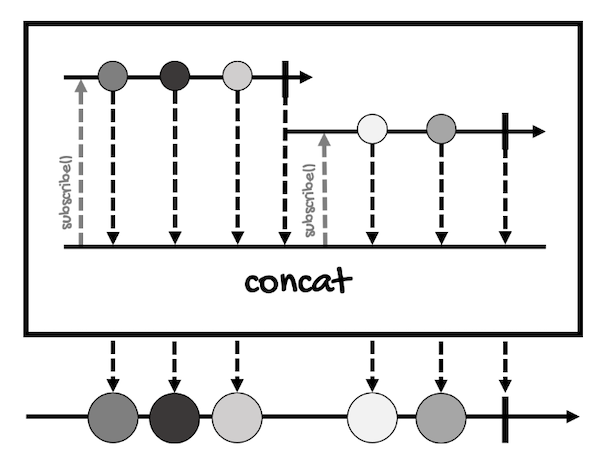

# Combining Publishers
---

Sometimes, you'll want to combine the values of two or more publishers or sequences. For this, there are three operators (and some of their variations) that you must learn:
- [merge](#merge)
- [concat](#concat)
- [zip](#zip)

## merge
As the name implies, this operator will merge two or more publishers into a `Flux` with the elements interleaved.

Here's the [marble diagram for this operator](https://projectreactor.io/docs/core/release/api/reactor/core/publisher/Flux.html#merge-org.reactivestreams.Publisher...-):


`merge` eagerly subscribes to the streams it receives as parameters, that's why the order of the output elements is not guaranteed.

It's only available for `Flux` and it takes a variable number of arguments of type `Publisher`:
```java
static Flux<I> merge(Publisher<? extends I>... sources)
```

Here's an example of how to use it:
```java
Flux<Integer> flux1 = Flux.just(1, 2, 3);
Flux<Integer> flux2 = Flux.just(4, 5, 6);

Flux<Integer> mergedFlux = 
    Flux.merge(flux1, flux2);
mergedFlux.subscribe(System.out::println);
```

Notice that `merge` is a static method. If you want to use it as an instance method, it won't work properly. In this case, you'll have to use `mergeWith`:
```java
Flux<T> mergeWith(Publisher<? extends T> other)
```

Here's the previous example using `mergeWith`:
```java
Flux<Integer> flux1 = Flux.just(1, 2, 3);
Flux<Integer> flux2 = Flux.just(4, 5, 6);

Flux<Integer> mergedFlux = flux1.mergeWith(flux2);
mergedFlux.subscribe(System.out::println);
```

This is the result for both examples:
```
1
2
3
4
5
6
```

But remember, like `flatMap`, these operators don't guarantee the order of the output elements.

`mergeWith` is also available for `Mono`:
```java
Flux<T> mergeWith(Publisher<? extends T> other)
```

As you can see, it accepts a `Publisher`and returns a `Flux`, so it's used just like the `Flux` version.

Back to `merge`, there are versions that take a `concurrency` and a `prefetch` argument:
```java
static <I> Flux<I> merge(
    int prefetch, 
    Publisher<? extends I>... sources
)

static <T> Flux<T> merge(
    Publisher<? extends Publisher<? extends T>> source, 
    int concurrency
)

static <T> Flux<T> merge(
    Publisher<? extends Publisher<? extends T>> source, 
    int concurrency, 
    int prefetch
)
```

Remember:
- `concurrency` indicates the maximum number of inner sources the operator subscribes to at the same time. 
- `prefetch` indicates the inner source request size.

There's also a version that takes elements from an `Iterable`:
```java
static <I> Flux<I> merge(
    Iterable<? extends Publisher<? extends I>> sources
)
```

And even one that takes elements from a `Publisher` of `Publisher`:
```java
static <T> Flux<T> merge(
    Publisher<? extends Publisher<? extends T>> source
)
```

Then we have `mergeComparing`, which orders the sequence by picking the smallest values from each source either as defined by their natural order or as defined by the provided `Comparator`:
```java
// Generic type "I" must be a Comparable type that has a natural order
static <I extends Comparable<? super I>> Flux<I> 
                mergeComparing(
                    Publisher<? extends I>... sources
                )
    
static <T> Flux<T> mergeComparing(
                    Comparator<? super T> comparator, 
                    Publisher<? extends T>... sources
)
    
static <T> Flux<T> mergeComparing(
                    int prefetch, 
                    Comparator<? super T> comparator, 
                    Publisher<? extends T>... sources
)
```

However, this operator doesn't order all the elements of all the sequences. From the [documentation](https://projectreactor.io/docs/core/release/api/reactor/core/publisher/Flux.html#mergeComparing-org.reactivestreams.Publisher...-):
> Merge data from provided Publisher sequences into an ordered merged sequence, by picking the smallest values from each source (as defined by their natural order). This is not a sort(), as it doesn't consider the whole of each sequences. Instead, this operator considers only one value from each source and picks the smallest of all these values, then replenishes the slot for that picked source.

Here's an example:
```java
Flux<Integer> flux1 = Flux.just(48, 45, 9);
Flux<Integer> flux2 = Flux.just(26, 58, 2);

Flux<Integer> mergedFlux = 
        Flux.mergeComparing(flux1, flux2);
mergedFlux.subscribe(System.out::println);
```

And this is the result when you run it:
```
26
48
45
9
58
2
```

Let me explain what `mergeComparing` is doing here:
- First, it compares `48` and `26`. The smallest value is `26`, so this one is added to the output `Flux`.
- Next, it compares `48` and `58`. Since `48` is the smallest value, this one is added to the output.
- Next, it compares `45` and `58`. The value `45` is added to the output.
- Next, it compares `9` and `58`. The value `9` is added to the output.
- Finally, the only elements left are `58` and `2`. Since both are from `flux2`, they are added to the output without being compared.

So this may not be what you need if you want an ordered output.

There's also a `mergeSequential` operator, which subscribes eagerly to the sequences provided, but unlike `merge`, it merges into the final sequence the emitted values in subscription order.

Here's an example:
```java
Flux<Integer> flux1 = Flux.just(10, 20, 30);
Flux<Integer> flux2 = Flux.just(40, 50, 60);

Flux<Integer> mergedFlux = Flux.mergeSequential(flux1, flux2);
mergedFlux.subscribe(System.out::println);
```

That will print the elements in subscription order:
```
10
20
30
40
50
60
```

`mergeSequential` also has versions that get all the source sequences from a `Publisher` or an `Iterator`:
```java
static <T> Flux<T> mergeSequential(
    Publisher<? extends Publisher<? extends T>> sources
)
static <I> Flux<I> mergeSequential(
    Iterable<? extends Publisher<? extends I>> sources
)
```

That take a `concurrency` and a `prefetch` argument:
```java
static <I> Flux<I> mergeSequential(
    int prefetch, Publisher<? extends I>... sources
)
static <T> Flux<T> mergeSequential(
    Publisher<? extends Publisher<? extends T>> sources, 
    int maxConcurrency, 
    int prefetch
)
static <I> Flux<I> mergeSequential(
    Iterable<? extends Publisher<? extends I>> sources, 
    int maxConcurrency, 
    int prefetch
)
```

And to delay errors:
```java
static <I> Flux<I> mergeSequentialDelayError(
    int prefetch, 
    Publisher<? extends I>... sources
)
static <T> Flux<T> mergeSequentialDelayError(
    Publisher<? extends Publisher<? extends T>> sources, 
    int maxConcurrency, 
    int prefetch
)
static <I> Flux<I> mergeSequentialDelayError(
    Iterable<? extends Publisher<? extends I>> sources, 
    int maxConcurrency,
    int prefetch
)
```

## concat
As the name implies, this operator concatenates all the sequences passed as arguments. It does this sequentially:
1. First, it subscribes to the first sequence.
2. Then, it waits for the sequence to complete before subscribing to the next.
3. And it repeats these steps until the last sequence completes. 

`concat` is only available for `Flux`:
```java
static <T> Flux<T> concat(Publisher<? extends T>... sources)
```

Take a look at its [marble diagram](https://projectreactor.io/docs/core/release/api/reactor/core/publisher/Flux.html#concat-org.reactivestreams.Publisher...-):



Here's an example of this operator:
```java
Flux<Integer> flux1 = Flux.just(10, 20, 30);
Flux<Integer> flux2 = Flux.just(40, 50, 60);

Flux<Integer> concatFlux = Flux.concat(flux1, flux2);
concatFlux.subscribe(System.out::println);
```

This is the result:
```
10
20
30
40
50
60
```

But we can also use the operator `concatWith` (just for `Flux`) to do the same:
```java
Flux<T> concatWith(Publisher<? extends T> other)
```

The difference, just like with `mergeWith`, is that this operator is used as an instance method:
```java
Flux<Integer> flux1 = Flux.just(10, 20, 30);
Flux<Integer> flux2 = Flux.just(40, 50, 60);

Flux<Integer> concatFlux = flux1.concatWith(flux2);
concatFlux.subscribe(System.out::println);
```

The result is basically the same as the result of the `mergeSequential` operator.

That's because `mergeSequential` and `concat` do the same thing but in a slightly different way. `mergeSequential` subscribes to the source sequences eagerly, while `concat` do it sequentially.

However, this means that if any error occurs during the execution of `concat`, it will interrupt the sequence immediately, producing a different output than `mergeSequential`.

You can compare the relationship between `mergeSequential` and `concat` with the relationship between `flatMapSequential` and `concatMap`.

`concat` also has versions that get all the source sequences from a `Publisher` or an `Iterator`:
```java
static <T> Flux<T>	concat(Publisher<? extends Publisher<? extends T>> sources)
static <T> Flux<T>	concat(Iterable<? extends Publisher<? extends T>> sources)
```

Take a `prefetch` argument:
```java
static <T> Flux<T>	concat(
    Publisher<? extends Publisher<? extends T>> sources, 
    int prefetch
)
```

And to delay errors:
```java
static <T> Flux<T>	concatDelayError(
    Publisher<? extends T>... sources
)
static <T> Flux<T>	concatDelayError(
    Publisher<? extends Publisher<? extends T>> sources
)
static <T> Flux<T>	concatDelayError(
    Publisher<? extends Publisher<? extends T>> sources, 
    int prefetch
)
static <T> Flux<T>	concatDelayError(
    Publisher<? extends Publisher<? extends T>> sources, 
    boolean delayUntilEnd, 
    int prefetch
)
```

## zip
This operator  waits for two or more sources to emit an element to combine these elements into an object that acts as a container, a tuple.

A tuple is an immutable data structure that groups non-null values. In Reactor, we have tuples that can group from two ([Tuple2<T1, T2>](https://projectreactor.io/docs/core/release/api/reactor/util/function/Tuple2.html)) to eight values ([Tuple8<T1, T2, T3, T4, T5, T6, T7, T8>](https://projectreactor.io/docs/core/release/api/reactor/util/function/Tuple6.html)).

Taking `Tuple2<T1,T2>` as example:
- `T1` is the type of the first non-null value held by the tuple.
- `T2` is the type of the second non-null value held by the tuple.

If you take a look at the [javadoc](https://projectreactor.io/docs/core/release/api/reactor/util/function/Tuple2.html) for `Tuple2<T1,T2>`, you'll find methods to get the values the tuple holds:
```java
// Get the object at the given index
Object get(int index)
    
// Get the first object of the tuple
T1 getT1()

// Get the second object of the tuple
T2 getT2()

// Return an immutable Iterator<Object> 
// for the content of the tuple
Iterator<Object> iterator()

// Return the number of elements in the tuple
int size()
```

To map a function to either the first or the second value:
```java
// Map the T1 value of the tuple into a different 
// value and type, keeping the T2 value intact
Tuple2<R,T2> mapT1(Function<T1,R> mapper)

// Map the T2 value of the tuple into a different
// value and type,keeping the T1 value intact
Tuple2<T1,R> mapT2(Function<T2,R> mapper)
```

And to turn the tuple into an array or list:
```java
Object[] toArray()

List<Object> toList()
```

The `zip` operator is available for `Mono` and `Flux`,

Take a look at its [marble diagram for `Mono`](https://projectreactor.io/docs/core/release/api/reactor/core/publisher/Mono.html#zip-reactor.core.publisher.Mono-reactor.core.publisher.Mono-):


However, this operator and has a lot of versions. We'll review the most important ones, starting with the version for `Tuple2`:
```java
// For Mono
static <T1,T2> Mono<Tuple2<T1,T2>> zip(
    Mono<? extends T1> p1, 
    Mono<? extends T2> p2
)

// For Flux
static <T1,T2> Flux<Tuple2<T1,T2>> zip(
    Publisher<? extends T1> source1, 
    Publisher<? extends T2> source2
)
```

This version works the same for `Mono` and `Flux`. So, assuming we have two sequences of type `Flux<Integer>`, the `zip` operator will return a `Flux` of type `Flux<Tuple2<Integer, Integer>>`:
```java
Flux<Integer> flux1 = Flux.just(1, 2, 3);
Flux<Integer> flux2 = Flux.just(4, 5, 6);

Flux<Tuple2<Integer, Integer>> zippedFlux = 
    Flux.zip(flux1, flux2);
zippedFlux.subscribe(System.out::println);
```

Here's the output for the above example, which shows the string representation of `Tuple2<Integer, Integer>`:
```
[1,4]
[2,5]
[3,6]
```

Now, you might be wondering what happens if the sequences have a different number of elements, for example:
```java
Flux<Integer> flux1 = Flux.just(1, 2, 3);
Flux<Integer> flux2 = Flux.just(4, 5);

Flux<Tuple2<Integer, Integer>> zippedFlux = 
    Flux.zip(flux1, flux2);
zippedFlux.subscribe(System.out::println);
```

Well, `zip` will combine the elements into a `Tuple2` until any of the sequences completes. Here's the result of the above example:
```
[1,4]
[2,5]
```
Another useful version is one that takes a `BiFunction` that specifies how the elements should be combined:
```java
// For Mono
static <T1,T2,O> Mono<O> zip(
    Mono<? extends T1> p1, 
    Mono<? extends T2> p2, 
    BiFunction<? super T1,? super T2,? extends O> combinator
)

// For Flux
static <T1,T2,O> Flux<O> zip(
    Publisher<? extends T1> source1, 
    Publisher<? extends T2> source2, 
    BiFunction<? super T1,? super T2,? extends O> combinator
)
```

Remember that `BiFunction` is a functional interface that defines a method that takes two arguments of type `T` and `U` to produce a result of type `R`:
```java
public interface BiFunction<T, U, R> {
    R apply(T var1, U var2);
}
```

Here's an example:
```java
Flux<Integer> flux1 = Flux.just(1, 2, 3);
Flux<Integer> flux2 = Flux.just(4, 5, 6);

Flux<Integer> zippedFlux = 
    Flux.zip(flux1, flux2, (i1, i2) -> i1 + i2);
zippedFlux.subscribe(System.out::println);
```

And this is the result:
```
5
7
9
```

Notice that this version of `zip` doesn't produce a tuple, it combines the elements of both sequences into one according to the provided function. In the above example, `1 + 4`, `2 + 5`, and `3 + 6`.

Then we have the versions of `zip` that take from three to eight sequences to produce tuples from three to eight elements.

Here are some examples for `Mono`:
```java
// For Mono
static <T1,T2,T3> 
        Mono<Tuple3<T1,T2,T3>> zip(
            Mono<? extends T1> p1, 
            Mono<? extends T2> p2, 
            Mono<? extends T3> p3
)
static <T1,T2,T3,T4,T5> 
        Mono<Tuple5<T1,T2,T3,T4,T5>> zip(
            Mono<? extends T1> p1, 
            Mono<? extends T2> p2, 
            Mono<? extends T3> p3, 
            Mono<? extends T4> p4, 
            Mono<? extends T5> p5
)
static <T1,T2,T3,T4,T5,T6,T7> 
        Mono<Tuple7<T1,T2,T3,T4,T5,T6,T7>> zip(
            Mono<? extends T1> p1, 
            Mono<? extends T2> p2, 
            Mono<? extends T3> p3, 
            Mono<? extends T4> p4, 
            Mono<? extends T5> p5, 
            Mono<? extends T6> p6, 
            Mono<? extends T7> p7
)
```

Some for `Flux`:
```java
static <T1,T2,T3,T4> 
        Flux<Tuple4<T1,T2,T3,T4>> zip(
            Publisher<? extends T1> source1, 
            Publisher<? extends T2> source2, 
            Publisher<? extends T3> source3, 
            Publisher<? extends T4> source4
)
static <T1,T2,T3,T4,T5,T6> 
        Flux<Tuple6<T1,T2,T3,T4,T5,T6>> zip(
            Publisher<? extends T1> source1, 
            Publisher<? extends T2> source2, 
            Publisher<? extends T3> source3, 
            Publisher<? extends T4> source4, 
            Publisher<? extends T5> source5, 
            Publisher<? extends T6> source6
)
static <T1,T2,T3,T4,T5,T6,T7,T8> 
        Flux<Tuple8<T1,T2,T3,T4,T5,T6,T7,T8>> zip(
            Publisher<? extends T1> source1, 
            Publisher<? extends T2> source2, 
            Publisher<? extends T3> source3, 
            Publisher<? extends T4> source4, 
            Publisher<? extends T5> source5, 
            Publisher<? extends T6> source6, 
            Publisher<? extends T7> source7, 
            Publisher<? extends T8> source8
)
```

And here's an example for `Tuple4`:
```java
Flux<Integer> flux1 = Flux.just(1, 2, 3);
Flux<Integer> flux2 = Flux.just(4, 5, 6);
Flux<Integer> flux3 = Flux.just(7, 8, 9);
Flux<Integer> flux4 = Flux.just(10, 11, 12);

Flux<
    Tuple4<
            Integer, 
            Integer, 
            Integer, 
            Integer
          >
    > zippedFlux = 
            Flux.zip(flux1, flux2, flux3, flux4);
zippedFlux.subscribe(System.out::println);
```

In this case, each tuple contains four elements:
```
[1,4,7,10]
[2,5,8,11]
[3,6,9,12]
```

There's also a version of `zip` that takes a variable number of sequences and uses a combination function that receive the elements as an array of objects:  
```java
// For Mono
static <R> Mono<R> zip(
    Function<? super Object[],? extends R> combinator, 
    Mono<?>... monos
)

// For Flux
static <I,O> Flux<O> zip(
    Function<? super Object[],? extends O> combinator, 
    Publisher<? extends I>... sources
)
// This version also takes a prefetch argument 
// to specify each source request size
static <I,O> Flux<O> zip(
    Function<? super Object[],? extends O> combinator, 
    int prefetch, 
    Publisher<? extends I>... sources
)
```

Here's an example that adds up the pairs of element from the sources passed as arguments:
```java
Flux<Integer> flux1 = Flux.just(1, 2, 3);
Flux<Integer> flux2 = Flux.just(4, 5, 6);

Flux<Integer> zippedFlux = Flux.zip(
        (Object[] elements) ->
                // Turn the array into a stream
                Arrays.stream(elements) 
                    // Cast an element to create an IntStream
                    .mapToInt(e -> (Integer)e) 
                    // Add up all the elements in the stream
                    .sum()
        ,flux1, flux2);
zippedFlux.subscribe(System.out::println);
```

This is the result:
```
5
7
9
```

However, there are versions that can also receive the sequences from an `Iterable` or as a `Publisher` of `Publisher` objects (the latter option only in the case of `Flux`):
```java
// For Mono
static <R> Mono<R> zip(
    Iterable<? extends Mono<?>> monos, 
    Function<? super Object[],? extends R> combinator
)

// For Flux
static <O> Flux<O> zip(
    Iterable<? extends Publisher<?>> sources, 
    Function<? super Object[],? extends O> combinator
)

static <O> Flux<O> zip(
    Iterable<? extends Publisher<?>> sources, 
    int prefetch, 
    Function<? super Object[],? extends O> combinator
)

static <TUPLE extends Tuple2,V> Flux<V> zip(
    Publisher<? extends Publisher<?>> sources, 
    Function<? super TUPLE,? extends V> combinator
)
```

Notice there's a version that takes a function that receives as argument a tuple instead of receiving an array of objects. Since all tuple classes from three to eight elements extend from `Tuple2`, the function can receive any tuple it requires.

For example, with a `Flux` of three `Flux` sequences, the function will receive an argument of type `Tuple3`. However, it won't always be necessary to cast the argument:
```java
Flux<Flux<Integer>> fluxOfFlux = Flux.just(
        Flux.just(1, 2, 3),
        Flux.just(4, 5, 6),
        Flux.just(7, 8, 9)
);

Flux<Integer> zippedFlux = Flux.zip(
        fluxOfFlux,
        (Tuple2 tuple) -> {
            int total = 0;
            for (int i = 0; i < tuple.size(); i++)
                total += (Integer)tuple.get(i);
            return total;
        }
);
zippedFlux.subscribe(System.out::println);
```

This will be the result:
```
12
15
18
```

Finally, we have a `zipWith` operator that can be used as an instance method:
```java
Flux<Integer> flux1 = Flux.just(1, 2, 3);
Flux<Integer> flux2 = Flux.just(4, 5, 6);

Flux<Tuple2<Integer, Integer>> zippedFlux = 
    flux1.zip(flux2);
zippedFlux.subscribe(System.out::println);
```

This `zipWith` operator offers fewer versions than `zip`. Versions that take a `BiFunction` to combine the elements, a `prefetch` argument, and versions that take the elements to combine from an `Iterable` (the last two for `Flux`):
```java
// For Mono:
Mono<O> zipWith(
    Mono<? extends T2> other, 
    BiFunction<? super T,? super T2,? extends O> combinator
)

// For Flux:
Flux<V> zipWith(
    Publisher<? extends T2> source2, 
    BiFunction<? super T,? super T2,? extends V> combinator
)

Flux<Tuple2<T,T2>> zipWith(
    Publisher<? extends T2> source2, 
    int prefetch
)
    
Flux<V> zipWith(
    Publisher<? extends T2> source2, 
    int prefetch, 
    BiFunction<? super T,? super T2,? extends V> combinator
)

Flux<Tuple2<T,T2>> zipWithIterable(
    Iterable<? extends T2> iterable
)

Flux<V> zipWithIterable(
    Iterable<? extends T2> iterable, 
    BiFunction<? super T,? super T2,? extends V> zipper
)
```
