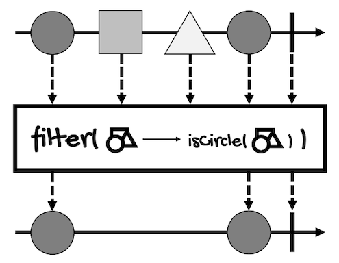

# Filtering Sequences
---

In addition to transformation, filtering is another important operation when working with sequences. In this lesson, we're going to review the following operators:
- [filter](#filter)
- [filterWhen](#filterwhen)
- [distinct](#distinct)
- [take](#take)
- [skip](#skip)

## filter
If you want to filter the elements of a sequence based on a determined condition, the `filter` operator must be your first choice. It works exactly the same as the [filter](https://docs.oracle.com/en/java/javase/17/docs/api/java.base/java/util/stream/Stream.html#filter(java.util.function.Predicate)) method from the Stream API:
```java
// For Mono
Mono<T> filter(Predicate<? super T> tester)

// For Flux
Flux<T> filter(Predicate<? super T> p)
```

This operator returns a `Mono` or a `Flux` with the elements that match the given [Predicate](https://docs.oracle.com/en/java/javase/17/docs/api/java.base/java/util/function/Predicate.html), a functional interface with the following method:
```java
@FunctionalInterface
public interface Predicate<T> {
    boolean test(T var1);
    // ...
}
```

Take a look at the [marble diagram of this operator for `Flux`](https://projectreactor.io/docs/core/release/api/reactor/core/publisher/Flux.html#filter-java.util.function.Predicate-):



Here's an example:
```java
Flux<Integer> integerFlux = 
    Flux.just(1, 2, 3, 4, 5, 6);

Flux<Integer> filteredFlux = 
    integerFlux.filter(i -> i % 2 == 0);

filteredFlux.subscribe(System.out::println);
```

If you run it, it will print the even values of the original `Flux`:
```
2
4
6
```

The odd values, the values that didn't match the filter, are discarded.

If we change the predicate so none of the elements match it:
```java
Flux<Integer> integerFlux = 
    Flux.just(1, 2, 3, 4, 5, 6);

Flux<Integer> filteredFlux = 
    integerFlux.filter(i -> i > 100);

filteredFlux.subscribe(System.out::println);
```

Nothing will be printed. 

In this case:
- `filteredFlux` completes without emitting values.
- Its type is still `Flux<Integer>`, not `Flux<Void>` or `Mono<Void>`. 

However, this operator can also discard elements upon cancellation or due to an error.

## filterWhen
Sometimes, you'd want to perform the predicate test asynchronously. For this cases, we have the `filterWhen` operator.

If you think of `filter` as a specialization of the `map` operator (both take a synchronous function and return a `Publisher`), you can think of `filterWhen` as a specialization of `flatMap`.

Here's the definition of the `filterWhen` operator:
```java
// For Mono
Mono<T> filterWhen(
    Function<? super T,? extends Publisher<Boolean>> asyncPredicate
)

// For Flux
Flux<T> filterWhen(
    Function<? super T,? extends Publisher<Boolean>> asyncPredicate
)
// bufferSize is the maximum expected number of values to hold 
// pending a result of their respective asynchronous test, 
// rounded to the next power of two.
Flux<T> filterWhen(
    Function<? super T,? extends Publisher<Boolean>> asyncPredicate, 
    int bufferSize
)
```

As you can see, `filterWhen` filters elements based on a `Publisher<Boolean>` rather than a `Predicate`.

This is the [marble diagram of this operator for `Flux`](https://projectreactor.io/docs/core/release/api/reactor/core/publisher/Flux.html#filterWhen-java.util.function.Function-):


Here's the example that filters even numbers adapted to `filterWhen`:
```java
Flux<Integer> integerFlux = 
    Flux.just(1, 2, 3, 4, 5, 6);

integerFlux
    .filterWhen(i -> Mono.just(i % 2 == 0))
    .subscribe(System.out::println);
```

The result is the same as before:
```
2
4
6
```

The function generates a `Publisher` of `Boolean` to test each value asynchronously. The element from the `Flux` or `Mono` is replayed if the value emitted by the `Publisher<Boolean>` is `true`. If the emitted value is `false` or empty, the element is dropped.
    
For example, the following code will print nothing:
```java
Flux<Integer> integerFlux = 
    Flux.just(1, 2, 3, 4, 5, 6);

integerFlux
    .filterWhen(i -> Mono.just(false))
    //.filterWhen(i -> Mono.empty()) // Same as false
    .subscribe(System.out::println);
```
    
Notice that the function allows us to also return a `Flux`, however, only the first value of the test publisher is considered. If the function returns a `Flux` with more than one value, the test will be canceled after receiving the first value.

Take the following code for example:
```java
Flux<Integer> integerFlux = 
    Flux.just(1, 2, 3, 4, 5, 6);

integerFlux
    .filterWhen(i -> Flux.just(i < 6, i % 2 == 0))
    .subscribe(System.out::println);
```

This is the result:
```
1
2
3
4
5
```

As you can see, only the first boolean expression of the `Flux` (`i < 6`) is used to filter the elements of `integerFlux`.

## distinct
As the name implies, this operator ignores duplicates. It only exists for `Flux`:
```java
Flux<T> distinct()
```

This operator tracks elements that have appeared before in the sequence to filter out duplicates.

Here's the [marble diagram of this operator](https://projectreactor.io/docs/core/release/api/reactor/core/publisher/Flux.html#distinct--):


If you run the following example:
```java
Flux<Integer> integerFlux = 
    Flux.just(1, 2, 3, 1, 4, 2);

integerFlux
    .distinct()
    .subscribe(System.out::println);
```

This is the result:
```
1
2
3
4
```

Since values `1` and `2` are duplicated, they are only included once.

To track elements, this operator adds the elements to a [HashSet](https://docs.oracle.com/en/java/javase/17/docs/api/java.base/java/util/HashSet.html). 

However, there are more versions of `distinct`.

For example, for each `Subscriber`, the following version tracks elements from the `Flux` that have been seen and filter out duplicates as compared by a key extracted through the user provided `Function`:
```java
<V> Flux<T> distinct(
    Function<? super T,? extends V> keySelector
)
```

For each `Subscriber`, this other version tracks elements from the `Flux` that have been seen and filters out duplicates, 
as compared by a key extracted through the user provided `Function` and by the add method of the `Collection` supplied (typically a `Set`):
```java
<V,C extends Collection<? super V>> Flux<T> distinct(
    Function<? super T,? extends V> keySelector, 
    Supplier<C> distinctCollectionSupplier
)
```

And the following version, that tracks elements from the `Flux` that have been seen and filters out duplicates, as compared by applying a [BiPredicate](https://docs.oracle.com/en/java/javase/17/docs/api/java.base/java/util/function/BiPredicate.html) that should typically add the key to the arbitrary store for further comparison. It also takes a function to extract the key, an arbitrary user-supplied `<C>` store, and a cleanup callback to be invoked on the store upon termination of the sequence:
```java
<V,C> Flux<T> distinct(
    Function<? super T,? extends V> keySelector, 
    Supplier<C> distinctStoreSupplier, 
    BiPredicate<C,V> distinctPredicate, 
    Consumer<C> cleanup
)
```

## distinctUntilChanged
This is a variation of the previous operator. Instead of ignoring duplicates, `distinctUntilChanged` ignores subsequent repetitions of an element (assuming they arrive one after another).

Here's the definition of this operator:
```java
Flux<T> distinctUntilChanged()
```

And its [marble diagram](https://projectreactor.io/docs/core/release/api/reactor/core/publisher/Flux.html#distinctUntilChanged--):


For example, considering the following `Flux`:
```java
Flux<Integer> integerFlux = 
    Flux.just(1, 1, 1, 2, 3, 3, 4, 2);
        
integerFlux
    .distinctUntilChanged()
    .subscribe(System.out::println);
```

This will be the result:
```
1
2
3
4
2
```

As you can see, `1` and `3` are repeated three and two times in a row respectively, but they are printed only once. However, notice that `2` is printed two times because this value doesn't repeat one after the other.

And just like `distinct`, this operator also has versions that allow you to customize how the function to compare keys from the values to detect duplicates and provide a `BiPredicate` to test elements for distinction:
```java
Flux<T> distinctUntilChanged(
    Function<? super T,? extends V> keySelector
)
Flux<T> distinctUntilChanged(
    Function<? super T,? extends V> keySelector, 
    BiPredicate<? super V,? super V> keyComparator
)
```

## take
Now it's the turn of the `take` operator and its variations. In general, these operators allow you to *take* certain elements from the sequences until a certain condition is fulfilled.

For `Mono`, only three versions of `take` make sense and they have to do with time.

The first one gives the `Mono` a chance to resolve within a specified time frame but completes (without error) if it doesn't:
```java
Mono<T> take(Duration duration)
```

The second one gives the `Mono` a chance to resolve within a specified time frame but completes (without error) if it doesn't. The timeframe is evaluated using the provided `Scheduler`:
```java
Mono<T> take(Duration duration, Scheduler timer)
```

And the third one gives the `Mono` a chance to resolve before the given `Publisher` emits a value. After that, the `Mono` completes without error:
```java
Mono<T> takeUntilOther(Publisher<?> other)
```

`Flux` has more variations of `take`.

For instance, to relay values from the `Flux` until the specified `Duration` elapses (optionally, the timeframe is evaluated using a provided `Scheduler`):
```java
Flux<T> take(Duration timespan)
Flux<T> take(Duration timespan, Scheduler timer)
```

To take only the first `N` values from the `Flux`, if available. If `n` is zero, the source is subscribed to but immediately cancelled, then the operator completes:
```java
Flux<T> take(long n)
```

Another version of this method takes an additional `limitRequest` parameter:
```java
Flux<T> take(
    long n, 
    boolean limitRequest
)
```

Here are the rules for this parameter:
- If `limitRequest` is `true`, it ensures that the total amount requested upstream is capped at `n`.
  - If `n` is zero, the source isn't even subscribed to and the operator completes immediately upon subscription.
- If `limitRequest` is `false`, this operator doesn't propagate the backpressure requested amount. Rather, it makes an unbounded request and cancels once `N` elements have been emitted. 
  - If `n` is zero, the source is subscribed to but immediately cancelled, then the operator completes. 

The `takeUntilOther` method gives the `Flux` a chance to resolve before the given `Publisher` emits a value:
```java
Flux<T> takeUntilOther(
    Publisher<?> other
)
```

The `takeLast` method emits the last `N` values the `Flux` emitted before its completion:
```java
Flux<T> takeLast(int n)
```

The `takeUntil` method relays values until the given `Predicate` matches (this includes the matching data):
```java
Flux<T> takeUntil(
    Predicate<? super T> predicate
)
```

And the `takeWhile` method relays values while a `Predicate` returns `true` (checked before each value is delivered and only including the matching data):
```java
Flux<T> takeWhile(
    Predicate<? super T> continuePredicate
)
```

Let me show you some examples.

The simpler version is the one that takes the number of elements you want from the `Flux`:
```java
Flux<Integer> integerFlux = 
    Flux.just(1, 2, 3, 4, 5);

integerFlux
        .take(2)
        .subscribe(System.out::println);
```

Here we are requesting the first two elements from the `Flux`, so the result shouldn't be a surprise:
```
1
2
```

But we can also specify a time frame to take elements until the time elapses:
```java
Flux<Integer> integerFlux = 
    Flux.just(1, 2, 3, 4, 5);

integerFlux
    .delayElements(Duration.ofMillis(1))
    .take(Duration.ofMillis(10))
    .subscribe(System.out::println);

try {
    Thread.sleep(100);
} catch (InterruptedException e) {
    e.printStackTrace();
}
```

In the above example, the `Flux` publishes elements with a delay on millisecond (with `delayElements(Duration.ofMillis(1))`) so we can take elements for ten milliseconds (with `take(Duration.ofMillis(10))`). This happens so fast that we have to give time for the program to execute (remember, we're working asynchronously). That's why we need to sleep the program for a little while.

The result may vary between executions. Sometimes, ten milliseconds will be enough to take all the elements from the `Flux`, while other times, the program will only take two or three elements during that period.

One thing to take into account is that the time frame starts when we subscribe to the `Publisher`. If you take a look at the marble diagram of this operator:


You'll see that the time of subscription and the time the operator starts executing is different.

This also means that if the duration is zero, the resulting `Flux` completes as soon as the `Flux` emits its first value, but this is not propagated, though.

Next, here's an example for `takeUntilOther`:
```java
Flux<Integer> integerFlux = 
    Flux.just(1, 2, 3, 4, 5);

integerFlux
    .delayElements(Duration.ofMillis(10))
    .takeUntilOther(
            Mono.just(10)
                .delayElement(Duration.ofMillis(5))
    )
    .subscribe(System.out::println);

try {
    Thread.sleep(100);
} catch (InterruptedException e) {
    e.printStackTrace();
}
```

In this case, nothing is printed. Each element is emitted every ten milliseconds but the `Mono` provided to `takeUntilOther` emits a value after five milliseconds, so, at this time, the `Flux` is canceled and nothing is emitted.

Now, about `takeUntil` and `takeWhile`, the difference between these operators may be confusing.

On the one hand, `takeUntil` propagates elements *until* the given predicate doesn't return `true`. 

On the other hand, `takeWhile` propagates elements *while* the given predicate returns `true`.

Consider this example for `takeUntil`:

```java
Flux<Integer> integerFlux = 
    Flux.just(1, 2, 3, 4, 5);

integerFlux
    .takeUntil(i -> i == 3)
    .subscribe(System.out::println);
```

Here's the result:
```
1
2
3
```

`1` is not equal to `3` so this value is emitted.

`2` is not equal to `3` so this value is emitted.

`3` is equal to `3`, so this value is emitted and, at this point, the `Flux` is cancelled and no more elements are emitted.

And for the `takeWhile` operator, consider the following example:
```java
Flux<Integer> integerFlux = 
    Flux.just(1, 2, 3, 4, 5);

integerFlux
    .takeWhile(i -> i < 4)
    .subscribe(System.out::println);
```

Here's the result:
```
1
2
3
```

`1` is less than `4` so this value is emitted.

`2` is less than `4` so this value is emitted.

`3` is less than `4` so this value is emitted.

`4` is not less than `4`, so this value is not emitted. Only matching values are emitted because the check is performed before emitting the value. At this point, the `Flux` is cancelled and no more elements are emitted.

## skip
You can think of this operator as the opposite of `take`. It allows you to *skip* elements from a sequence until a certain condition is fulfilled. The skipped elements are discarded, whereas the remaining elements are emitted.

This operator is only available for `Flux` (it wouldn't make any sense to skip the only element a `Mono` emits). Like `take`, it has versions that take a `Duration`, another `Publisher`, the number of elements to skip, and a `Predicate`.

For example, use this version to skip elements from the `Flux` emitted within the specified initial duration:
```java
Flux<T> skip(Duration timespan)
```

Use this version to skip elements from the `Flux` emitted within the specified initial duration, as measured on the provided `Scheduler`:
```java
Flux<T> skip(Duration timespan, Scheduler timer)
```

This version to skip the specified number of elements from the beginning of the `Flux`, then emit the remaining elements:
```java
Flux<T> skip(long skipped)
```

Use `skipUntilOther` to skip values from the `Flux` until a specified `Publisher` emits a value:
```java
Flux<T> skipUntilOther(Publisher<?> other)
```

Use `skipLast` to skip a specified number of elements at the end of the `Flux` sequence:
```java
Flux<T> skipLast(int n)
```

Use `skipUntil` to skip values from the `Flux` until a `Predicate` returns `true` for the value (the resulting `Flux` will include and emit the matching value):
```java
Flux<T> skipUntil(Predicate<? super T> untilPredicate)
```

And use `skipWhile` to skip values from the `Flux` while a `Predicate` returns `true` for the value:
```java
Flux<T> skipWhile(Predicate<? super T> skipPredicate)
```

For instance, this is the [marble diagram for the version that takes the number of elements to skip](https://projectreactor.io/docs/core/release/api/reactor/core/publisher/Flux.html#skip-long-):


Let's review some code examples.

Starting with the version that takes the number of elements to skip:
```java
Flux<Integer> integerFlux = 
    Flux.just(1, 2, 3, 4, 5);

integerFlux
    .skip(2)
    .subscribe(System.out::println);
```

In this case, the above example will skip the first two elements of the sequence:
```
3
4
5
```

For the version that takes a `Duration` object:
```java
Flux<Integer> integerFlux = 
    Flux.just(1, 2, 3, 4, 5);

integerFlux
    .delayElements(Duration.ofMillis(1))
    .skip(Duration.ofMillis(5))
    .subscribe(System.out::println);

try {
    Thread.sleep(100);
} catch (InterruptedException e) {
    e.printStackTrace();
}
```

The results may vary between executions, but the above example skips elements during five milliseconds, printing, most of the time, the last three or two elements:
```
3
4
5
```

Just like some of the examples of `take`, we have to sleep the program for a little while to give time to complete its execution.

Now, consider the following example:
```java
Flux<Integer> integerFlux = 
    Flux.just(1, 2, 3, 4, 5);

integerFlux
    .delayElements(Duration.ofMillis(10))
    .skipUntilOther(
        Mono.just(10).delayElement(Duration.ofMillis(5))
    )
    .subscribe(System.out::println);

try {
    Thread.sleep(100);
} catch (InterruptedException e) {
    e.printStackTrace();
}
```

With `skipUntilOther`, the above example specifies that it should skip elements for five milliseconds, however, each element is emitted every ten milliseconds, so none of the elements are skipped. This is the result:
```
1
2
3
4
5
```

Now, the difference between `skipUntil` and `skipWhile` is similar to the difference between `takeUntil` and `takeWhile`.

`skipUntil` skips values *until* a `Predicate` returns `true`, including and emitting the matching value.

Here's an example:
```java
Flux<Integer> integerFlux = 
    Flux.just(1, 2, 3, 4, 5);

integerFlux
    .skipUntil(i -> i == 3)
    .subscribe(System.out::println);
```

This is the result:
```
3
4
5
```

`1` is not equal to `3` so this value is skipped.

`2` is not equal to `3` so this value is skipped.

`3` is equal to `3`, so this and all the subsequent values are emitted.

Then we have `skipWhile`, which skips values *while* a `Predicate` returns `true`.

Here's an example:
```java
Flux<Integer> integerFlux = 
    Flux.just(1, 2, 3, 4, 5);

integerFlux
    .skipWhile(i -> i < 4)
    .subscribe(System.out::println);
```

This is the result:
```
4
5
```

`1` is less than `4` so this value is skipped.

`2` is less than `4` so this value is skipped.

`3` is less than `4` so this value is skipped.

`4` is not less than `4`, so this and all subsequent values are emitted.
