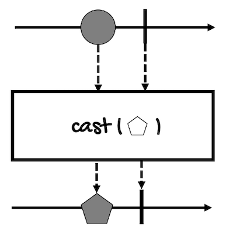
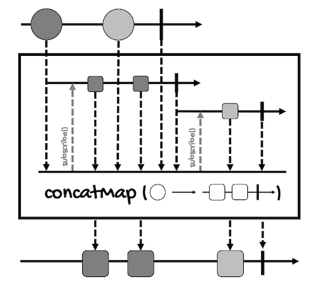
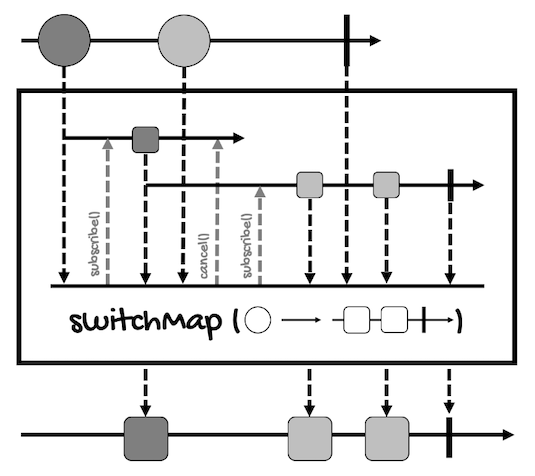

# More Operators For Transforming Sequences
---

In the last module, we reviewed `map` and `flatMap`, but there are more operators for transforming sequences. 

In this lesson, we're going to review:
- [cast](#cast)
- [concatMap](#concatmap)
- [switchMap](#switchmap)

## cast
This operator is very simple but can be useful sometimes. It allows us to cast the type of the elements of a `Publisher` to an assignable type according to the `isInstance` operator. It works like the `map` operator, but the only transformation it allows is casting the type.

Here's the definition for `Mono` and `Flux`:
```java
// For Mono
Mono<E> cast(Class<E> clazz)

// For Flux
Flux<E> cast(Class<E> clazz)
```

It works the same for both. 

Take a look at the [marble diagram for `Mono`](https://projectreactor.io/docs/core/release/api/reactor/core/publisher/Mono.html#cast-java.lang.Class-):




Here's an example for `Flux` that converts all the elements of a `Flux<Number>` to a `Flux<Long>`:
```java
Flux<Number> fluxNumber = Flux.just(1L, 2L, 3L);
Flux<Long> fluxLong = fluxNumber.cast(Long.class);
fluxLong.subscribe(System.out::println);
```

In this example, we're explicitly working with `long` values (notice the `L`). If we were casting to a `Flux<Integer>`:
```java
Flux<Number> fluxString = Flux.just(1L, 2L, 3L);
Flux<Integer> fluxInteger = fluxString.cast(Integer.class);
fluxInteger.subscribe(System.out::println);
```

The program will throw a `ClassCastException`:
```
[ERROR] (main) Operator called default onErrorDropped - reactor.core.Exceptions$ErrorCallbackNotImplemented: java.lang.ClassCastException: Cannot cast java.lang.Long to java.lang.Integer
reactor.core.Exceptions$ErrorCallbackNotImplemented: java.lang.ClassCastException: Cannot cast java.lang.Long to java.lang.Integer
Caused by: java.lang.ClassCastException: Cannot cast java.lang.Long to java.lang.Integer
	at java.base/java.lang.Class.cast(Class.java:3889)
```

As you can see, under the hood, this operator uses the method `Class.cast()`, which internally uses the `isInstance` operator, so the above code will also throw an exception if we try to cast `Flux<Number>` to `Flux<String>`, for example. 

## concatMap
In the previous module, we talked about how `flatMap` cannot guarantee that the order of the output elements will be preserved. 

If you run the following example:
```java
Flux<Integer> fluxInt = Flux.just(1, 2, 3, 4);
Flux<Integer> fluxFlat = 
    fluxInt
        .flatMap(i -> transformAsyncPublisherDelay(i));
fluxFlat.subscribe(System.out::println);

// ...

public Publisher<Integer> transformAsyncPublisherDelay(int i) {
    return i % 2 == 0 
            ? Flux.just(i, i+1) 
            : Mono.just(i * 10);
}
```

This will be the result:
```
10
30
2
3
4
5
```

But if you use `flatMapSequential`:
```java
Flux<Integer> fluxInt = Flux.just(1, 2, 3, 4);
Flux<Integer> fluxFlat = 
    fluxInt
        .flatMapSequential(i -> transformAsyncPublisherDelay(i));
fluxFlat.subscribe(System.out::println);
```

The order will be preserved:
```
10
2
3
30
4
5
```

`concatMap` is similar to `flatMapSequential`. It's only available for `Flux`:
```java
Flux<V> concatMap(
    Function<? super T,? extends Publisher<? extends V>> mapper
)
```

Here's an example:
```java
Flux<Integer> fluxInt = Flux.just(1, 2, 3, 4);
    Flux<Integer> fluxConcat = 
        fluxInt
            .concatMap(i -> transformAsyncPublisherDelay(i));
    fluxConcat.subscribe(System.out::println);
```

This is the result:
```
10
2
3
30
4
5
```

As you can see, it also preserves the order of the elements.

However, under the hood, `flatMapSequential` and `concatMap` work differently: 
- `flatMapSequential` subscribes to its inner publishers eagerly (like `flatMap`), queueing faster publishers until earlier publishers complete to maintain the order.
- `concatMap` waits for one inner publisher to complete before subscribing to the next one to maintain the order. Hence the name, it concatenates the inner publishers from each source element sequentially.

Take a look at the [marble diagram of `concatMap`](https://projectreactor.io/docs/core/release/api/reactor/core/publisher/Flux.html#concatMap-java.util.function.Function-):



In practical terms, the result is the same, but be careful. In case of an error, for example, with `concatMap` the concatenation will stop at that point, possibly resulting in a different output if you had used `flatMapSequential`. So always take into account how these operators perform the transformation.

Like `flapMap`, `concatMap` also has versions that take a `prefetch` argument, one that delays errors, and others to transform the elements into `Iterable` objects:
```java
Flux<V> concatMap(
    Function<? super T,? extends Publisher<? extends V>> mapper, 
    int prefetch
)

Flux<V> concatMapDelayError(
    Function<? super T,? extends Publisher<? extends V>> mapper
)
Flux<V> concatMapDelayError(
    Function<? super T,? extends Publisher<? extends V>> mapper, 
    boolean delayUntilEnd, 
    int prefetch
)
Flux<V> concatMapDelayError(
    Function<? super T,? extends Publisher<? extends V>> mapper, 
    int prefetch
)
    
Flux<R> concatMapIterable(
    Function<? super T,? extends Iterable<? extends R>> mapper
)
Flux<R> concatMapIterable(
    Function<? super T,? extends Iterable<? extends R>> mapper, 
    int prefetch
)
```

For a more detailed example, take a look at [this Stack Overflow answer](https://stackoverflow.com/a/71972337/3593852).

## switchMap
In addition to `concatMap`, there's another operator that works like `flatMapSequential`, `switchMap`.

Take a look at the [marble diagram of `switchMap`](https://projectreactor.io/docs/core/release/api/reactor/core/publisher/Flux.html#switchMap-java.util.function.Function-):



1. When the source `Flux` emits the first circle (dark gray), `switchMap` subscribes to the inner publisher for that circle.
2. When the source `Flux` emits the next circle (light gray), `switchMap` cancels the subscription to the publisher of the first circle (dark gray) and subscribes to the publisher for the next one (light gray). This means that no further elements from the first publisher will be included in the output.
3. Step two is repeated for the next elements of the `Flux`. This means that not all the transformed elements will be included in the output, most likely, only the ones produced for the last elements of the source `Flux`.

Here's the definition of `switchMap` for `Flux`:
```java
Flux<V> switchMap(
    Function<? super T,Publisher<? extends V>> fn
)
```

It's used just like `flapMap` and similar operators:
```java
Flux<Integer> fluxInt = Flux.just(1, 2, 3, 4);
    Flux<Integer> fluxSwitch = fluxInt
            .switchMap(i -> transformAsyncPublisherDelay(i));
    fluxSwitch.subscribe(System.out::println);
```

However, for the above example, this will be the result:
```
10
30
4
5
```

As you can see, the elements `2` and `3` were not emitted.

This operator is used when you're interested only in the last results. For example, when you're programming an autocomplete widget, you're only interested in the last letters (or the complete word) typed by the user. If the user inputs *Reactor*, there's no need to show the results for *R* or *Re* after the user types the complete word.

If you want to know more, [this article](https://medium.com/digitalfrontiers/reactive-programming-the-hitchhikers-guide-to-map-operators-7d8bbc1d8465) compares all the `*Map` operators we've talked about and reviews in more detail `switchMap`.
