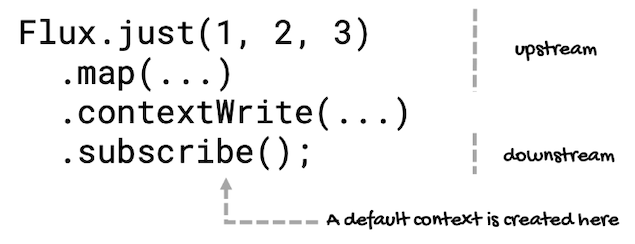

# Writing and Reading the Context
---
As I mentioned before, a `Context` is populated at subscription time, one `Context` for each `Subscriber`. This way, all the operators upstream in the chain will have access to it.

But to use a `Context`, you must associate it to a sequence and populate it. For this, you have to use the `contextWrite` operator, available for `Flux` and `Mono`.

There are two `contextWrite` operators for `Mono`. The first one merges all the values from the provided `ContextView` with the downstream `Context`:
```java
Mono<T> contextWrite(ContextView contextToAppend)
```

And the second one adds entries to the `Context` by applying a `Function` to the downstream `Context`. The `Function` takes a `Context` so you can add the entries and return a new `Context`:
```java
Mono<T> contextWrite(Function<Context, Context> contextModifier)
```

Of course, we have similar operators for `Flux`:
```java
Flux<T> contextWrite(ContextView contextToAppend)

Flux<T> contextWrite(Function<Context, Context> contextModifier)
```

Since `Context` is an immutable structure, both methods create a new `Context`. And they do it from the downstream `Context` (by default an empty one) they receive.

Why the *downstream* `Context`?

Because the `Context` starts with the `subscribe` method, the last one in the sequence, and moves from the bottom to the top (from the perspective of the `contextWrite` method):



So the context comes from the bottom of the sequence and reaches the `contextWrite` operator, where a new, enriched `Context` is created, and this is propagated to the operators that are placed above in the chain.

This way:
- `contextWrite(ContextView)` merges the `ContextView` it receives as its argument and the `Context` from downstream, using the `putAll(ContextView other)` method from `Context`.
- `contextWrite(Function<Context, Context>)` takes a `Function` that receives a copy of the `Context` from downstream so you can add or remove values, and return the new `Context`.

On the other hand, to get the values stored in the `Context`, you can use `deferContextual` or `transformDeferredContextual`.

For `Mono`, `deferContextual` creates a `Mono` provider that will supply a target `Mono` to subscribe to for each `Subscriber` downstream:
```java
static <T> Mono<T> deferContextual(
    Function<ContextView, 
             ? extends Mono<? extends T>
    > contextualMonoFactory
)
```

`transformDeferredContextual` defers the given transformation to this `Mono` in order to generate a target `Mono` type:
```java
Mono<V> transformDeferredContextual(
    BiFunction<? super Mono<T>,
               ? super ContextView,
               ? extends Publisher<V>
    > transformer)
```

For `Flux`, `deferContextual` lazily supplies a `Publisher` every time a `Subscription` is made on the resulting `Flux`, so the actual source instantiation is deferred until each subscription, and the `Function` can create a subscriber-specific instance:
```java
static <T> Flux<T> deferContextual(
    Function<ContextView, 
             ? extends Publisher<T>
    > contextualPublisherFactory
)
```

While `transformDeferredContextual` defers the given transformation to the `Flux` in order to generate a target `Flux` type:
```java
Flux<V> transformDeferredContextual(
    BiFunction<? super Flux<T>,
               ? super ContextView,
               ? extends Publisher<V>
    > transformer
)
```

Notice that these operators use `ContextView`. Since we're only reading values, writing methods are not necessary.

The `deferContextual` operators work like `defer` (for [Mono](https://projectreactor.io/docs/core/release/api/reactor/core/publisher/Mono.html#defer-java.util.function.Supplier-) and [Flux](https://projectreactor.io/docs/core/release/api/reactor/core/publisher/Flux.html#defer-java.util.function.Supplier-)). The difference is that instead of a `Supplier`, `deferContextual` takes a `Function` that receives a `ContextView` instance (to get the values of the context) and returns either a `Mono` or a `Publisher` (for `Flux`) for each subscription.

In the case of `transformDeferredContextual`, it takes a `BiFunction` that receives the `Mono` or `Flux` coming from upstream and a `ContextView` instance, so it can transform them into a new `Publisher`. This transformation will also occur for each `Subscriber`. 

But unlike `deferContextual`, `transformDeferredContextual` is not a static method, so you can use it at any point of a sequence. Here's an example:
```java
String key = "multiplier";
Flux<Integer> fluxInteger = Flux.just(1, 2, 3, 4, 5)
    .map(i -> i * 10)
    .transformDeferredContextual(
            (flux, ctx) ->
               flux.map(i -> i * ctx.getOrDefault(key, 1))
    );

fluxInteger
    .contextWrite(Context.of(key, 10))
    .subscribe(System.out::println);
fluxInteger
    .contextWrite(Context.of(key, 100))
    .subscribe(System.out::println);
```

Inside `transformDeferredContextual`, with a `map` operator, each element of the sequence is multiplied by the value stored in the context (the method `getOrDefault` will return a default value in case the given key cannot be resolved within the context).

And to demonstrate that `transformDeferredContextual` is executed on a *per-subscriber* basis, there are two subscriptions to the same `Flux`, each setting a different value to the key used inside the `map` operator.

Here's the result:
```
100
200
300
400
500
1000
2000
3000
4000
5000
```

The first sequence is multiplied by `100` (`10` and then `10`), and the second sequence is multiplied by `1000` (`10` and then `100`).

Also, to demonstrate that a `Context` is visible to operators executing on different threads, we can add a `publishOn` operator below the `map` operator, for example:
```java
String key = "multiplier";
Flux<Integer> fluxInteger = Flux.just(1, 2, 3, 4, 5)
    .map(i -> i * 10)
    .publishOn(Schedulers.newParallel("parallel"))
    .transformDeferredContextual(
            (flux, ctx) ->
                    flux.map(i -> i * ctx.getOrDefault(key, 1))
    );

fluxInteger
    .contextWrite(Context.of(key, 10))
    .subscribe(System.out::println);
```

Here's the result:
```
100
200
300
400
500
```

The elements of the `Flux` are still multiplied by the value stored in the `Context`.

However, most of the time, you'll use `deferContextual` inside a `flatMap` operator (since they both return a `Publisher`). Here's an example:
```java
String key = "multiplier";
Flux<Integer> fluxInteger = Flux.just(1, 2, 3, 4, 5)
    .flatMap(i -> Mono.deferContextual(ctx ->
                Mono.just(i * ctx.getOrDefault(key, 1))
            )
    )
    .contextWrite(Context.of(key, 10));

fluxInteger.subscribe(System.out::println);
```

Although `contextWrite` is placed at the end of the sequence, it's the first operator to be executed so the `Context` it creates can be available to operators upstream. 

Then, inside the `flatMap` operator, we extract and use the value associated with the key `ID`, so it can emit the value multiplied by `10` to the subscriber.

Also, I could have used `Flux.deferContextual` and returned a `Flux`, but since we're working with just one value, and `flatMap` will flatten all the returned `Publisher` instances into a `Flux`, it doesn't matter whether we use `Mono` or `Flux`.

However, the position in the sequence where you place `contextWrite` matters.

Consider this example:
```java
String key = "multiplier";
Mono<Integer> monoInteger = Mono.just(1)
    .flatMap(i -> Mono.deferContextual(ctx -> {
                        System.out.println(
                            "flatMap1: " + ctx
                        );
                        return Mono.just(i);
                    }
            )
    )
    .contextWrite(Context.of(key, 10))
    .flatMap(i -> Mono.deferContextual(ctx -> {
                        System.out.println(
                            "flatMap2: " + ctx
                        );
                        return Mono.just(i);
                    }
            )
    );

monoInteger.subscribe();
```

It just prints the string representation of the `Context` inside the `flatMap` operators above and below `contextWrite`.

This is the result:
```
flatMap1: Context1{multiplier=10}
flatMap2: Context0{}
```

First of all, notice that the contexts are different: 
- `Context0`, for the `flatMap` operator below `contextWrite`, which is empty.
- `Context1`, which contains the `key` multiplier, set by the `contextWrite` below the first `flatMap` operator.

Similarly, if you set the value of the same key more than once:
```java
String key = "multiplier";
Mono<Integer> monoInteger = Mono.just(1)
    .flatMap(i -> Mono.deferContextual(ctx -> {
                        System.out.println(ctx);
                        return Mono.just(i);
                    }
            )
    )
    .contextWrite(Context.of(key, 100))
    .contextWrite(Context.of(key, 10));

monoInteger.subscribe();
```

The operator will see the closest `Context` downstream (the closest one under it). In this case, the `Context` with the value `100`.

Here's the result:
```
Context1{multiplier=100}
```

The key here is the word *downstream*.

If we add a `flatMap` operator between the `contextWrite` operators of the previous example:
```java
String key = "multiplier";
Mono<Integer> monoInteger = Mono.just(1)
    .flatMap(i -> Mono.deferContextual(ctx -> {
                        System.out.println(
                            "flatMap1: " +ctx
                        );
                        return Mono.just(i);
                    }
            )
    )
    .contextWrite(Context.of(key, 100))
    .flatMap(i -> Mono.deferContextual(ctx -> {
                        System.out.println(
                            "flatMap2: " + ctx
                        );
                        return Mono.just(i);
                    }
            )
    )
    .contextWrite(Context.of(key, 10));

monoInteger.subscribe();
```

This will be the result:
```
flatMap1: Context1{multiplier=100}
flatMap2: Context1{multiplier=10}
```

Both `flatMap` operators see different contexts. The closest ones under them (downstream).

Finally, if you add a value to the `Context` inside an operator:
```java
String key = "multiplier";
Mono<Integer> monoInteger = Mono.just(1)
    .flatMap(i -> Mono.deferContextual(ctx -> {
                        System.out.println(
                            "flatMap(main sequence): " + ctx
                        );
                        return Mono.just(i);
                    }
            )
    )
    .flatMap(i -> Mono.deferContextual(ctx -> {
                        System.out.println(
                            "flatMap(inner Context): " + ctx
                        );
                        return Mono.just(i);
                    }
            )
            .contextWrite(Context.of(key, 100))
    )
    .contextWrite(Context.of(key, 10));

monoInteger.subscribe();
```

In this case, in the second `flatMap`, the value set in the context will not propagate to the main sequence:
```
flatMap(main sequence): Context1{multiplier=10}
flatMap(inner Context): Context1{multiplier=100}
```

For this reason, the first `flatMap` cannot see that value. 
