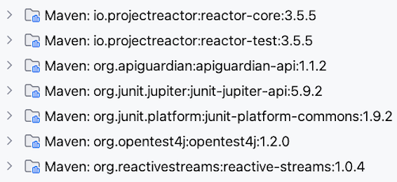
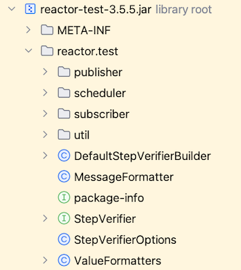
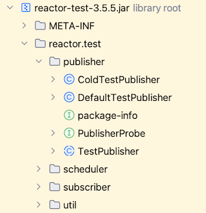

# Setting up Tests
* * *
Reactor provides a dedicated set of classes for testing reactive sequences that are grouped in the artifact [reactor-test](https://github.com/reactor/reactor-core/tree/main/reactor-test/src).

This means that to use those classes, in addition to `reactor-core`, you must add `reactor-test` as a test dependency of your project.

In Maven, add the following to the `dependencies` section of your `pom.xml` file:
```xml
<dependency>
    <groupId>io.projectreactor</groupId>
    <artifactId>reactor-test</artifactId>
    <scope>test</scope>
</dependency>
```

Remember that if you use `reactor-bom`, you don't need to specify a version.

If you use Gradle, add the following dependency to the `build.gradle` file:
```
dependencies {
   testCompile 'io.projectreactor:reactor-test'
}
```

After adding this dependency, the external libraries section of your project should look something like this:



If you open the `reactor-test` JAR file, you'll see the following classes and interfaces:



The main interface of `reactor-test` is `StepVerifier`, which provides a step by step, declarative way of testing how a reactive sequence behaves upon subscription.

But there are others less-known classes or interfaces, that can be useful. For example, `PublisherProbe` and `TestPublisher`, which are both in the `publisher` package:



Let's start with `StepVerifier` and its API.
