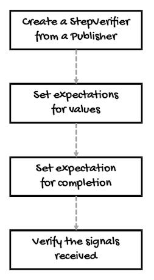

# Testing a Reactive Sequence with StepVerifier
* * *
[StepVerifier](https://projectreactor.io/docs/test/release/api/reactor/test/StepVerifier.html) allows us to define, one, the expectations when we subscribe to a publisher, answering questions such as:
- How many elements do we expect next?
- For how much time can we expect no elements?
- Do the publisher has discarded at least one element?

And two, what happens when our stream completes:
- Do we expect a completion signal?
- Do we expect an error of the specified type?
- Do we expect the sequence times out after a provided `Duration`?

You can test every step of the sequence, and if one of them doesn't match your defined expectation, `StepVerifier` will throw an `AssertionError`.

In general, here's what you can do to test a sequence:



1. Create a `StepVerifier` from a `Publisher` using methods such as `create(Publisher)` or `withVirtualTime(Supplier<Publisher>)`.
2. Define expectations about the values of the sequence using methods such as `expectNext(T t)` or `expectNextMatches(Predicate)`.
3. Finalize the test using a terminal expectation such as `expectComplete()` or `expectError()`.
4. Verify all the expectations and signals by calling one of the verification methods such as `verify()` or `verify(Duration)`.

For this, the methods of `StepVerifier` work with four nested interfaces:
- `StepVerifier.FirstStep<T>`, for testing the expectation of a `Subscription` as the first signal.
- `StepVerifier.Step<T>`, for testing the expectation of main sequence individual signals.
- `StepVerifier.Assertions`, for post-verification state assertions.
- `StepVerifier.ContextExpectations<T>`, for testing expectations about the `Context`.
- `StepVerifier.LastStep`, for testing terminal states.

Let's review a few examples.

First of all, we'll need a `Flux` or `Mono` to test its behavior:
```java
Flux<Integer> getFlux() {
    return Flux.just(1, 2, 3, 4)
            .filter(i -> i % 2 == 0);
}
```

Now, we can use `StepVerifier` to test if the sequence really contains `2` and `4`, for example:
```java
StepVerifier
  .create(getFlux())              // 1
  .expectNext(2)                  // 2
  .expectNextMatches(i -> i == 4) // 3
  .expectComplete()               // 4
  .verify();                      // 5
```

`StepVerifier`'s API follows the style of the [builder pattern](https://www.adevguide.com/builder-design-pattern-java/) for chaining methods: 
1. First, we get a `StepVerifier` instance by passing the sequence to test the static method `create`.
2. Then, we set up an expectation for the first element emitted by the sequence. In this case, with the method `expectNext(T)`, we can pass the value we're expecting directly.
3. Next, we do the same for the second element, but this time, using the method `expectNextMatches(Predicate)`, we can use a `Predicate` to test something about the emitted value.
4. In this case, the sequence should complete, so with `expectComplete()`, we test for a completion signal.
5. Finally, we call the method `verify()` to trigger the test.

The result of running this example will be a passed test. 

Remember, if any of the expectations fail, `StepVerifier` will throw an `AssertionError`, making the whole test fail.

For example, if we comment out `expectNextMatches(i -> i == 4)`, the test will expect a completion signal after the sequence emits the first element, which is not correct and will cause the following error:
```
java.lang.AssertionError: expectation "expectComplete" failed (expected: onComplete(); actual: onNext(4))
	at reactor.test.MessageFormatter.assertionError(MessageFormatter.java:115)
	at reactor.test.MessageFormatter.failPrefix(MessageFormatter.java:104)
	at reactor.test.MessageFormatter.fail(MessageFormatter.java:73)
	at reactor.test.MessageFormatter.failOptional(MessageFormatter.java:88)
	at reactor.test.DefaultStepVerifierBuilder.lambda$expectComplete$4(DefaultStepVerifierBuilder.java:344)
	at reactor.test.DefaultStepVerifierBuilder$SignalEvent.test(DefaultStepVerifierBuilder.java:2288)
	at reactor.test.DefaultStepVerifierBuilder$DefaultVerifySubscriber.onSignal(DefaultStepVerifierBuilder.java:1528)
	at reactor.test.DefaultStepVerifierBuilder$DefaultVerifySubscriber.onExpectation(DefaultStepVerifierBuilder.java:1476)
	at reactor.test.DefaultStepVerifierBuilder$DefaultVerifySubscriber.onNext(DefaultStepVerifierBuilder.java:1146)
	at reactor.core.publisher.FluxFilterFuseable$FilterFuseableSubscriber.onNext(FluxFilterFuseable.java:118)
	at reactor.core.publisher.FluxArray$ArrayConditionalSubscription.fastPath(FluxArray.java:340)
	at reactor.core.publisher.FluxArray$ArrayConditionalSubscription.request(FluxArray.java:263)
	at reactor.core.publisher.FluxFilterFuseable$FilterFuseableSubscriber.request(FluxFilterFuseable.java:191)
	at reactor.test.DefaultStepVerifierBuilder$DefaultVerifySubscriber.onSubscribe(DefaultStepVerifierBuilder.java:1161)
	at reactor.core.publisher.FluxFilterFuseable$FilterFuseableSubscriber.onSubscribe(FluxFilterFuseable.java:87)
	at reactor.core.publisher.FluxArray.subscribe(FluxArray.java:50)
	at reactor.core.publisher.FluxArray.subscribe(FluxArray.java:59)
	at reactor.core.publisher.Flux.subscribe(Flux.java:8466)
	at reactor.test.DefaultStepVerifierBuilder$DefaultStepVerifier.toVerifierAndSubscribe(DefaultStepVerifierBuilder.java:891)
	at reactor.test.DefaultStepVerifierBuilder$DefaultStepVerifier.verify(DefaultStepVerifierBuilder.java:831)
	at reactor.test.DefaultStepVerifierBuilder$DefaultStepVerifier.verify(DefaultStepVerifierBuilder.java:823)
	at net.eherrera.reactor.m9.Test_01_StepVerifierAPI.example_01_SimpleExample(Test_01_StepVerifierAPI.java:18)
	...

```

Now let's review each step in more detail.

The `create` method has three versions.

The first one takes the publisher to subscribe to and verify:
```java
StepVerifier.FirstStep<T> create(
    Publisher<? extends T> publisher
)
```

The second one takes an additional parameter that represents the amount of items to request:
```java
StepVerifier.FirstStep<T> create(
    Publisher<? extends T> publisher, long n
)
```

And the third one, in addition the publisher, takes an instance of the class [StepVerifierOptions](https://projectreactor.io/docs/test/release/api/reactor/test/StepVerifierOptions.html):
```java
StepVerifier.FirstStep<T> create(
    Publisher<? extends T> publisher, 
    StepVerifierOptions options
)
```

For example, one option you can pass is the name for the whole test scenario that will be used assertion error messages. Consider the following code: 
```java
StepVerifier
    .create(getFlux(), 
            StepVerifierOptions.create().scenarioName("my-example"))
    .expectNext(2)
    //.expectNextMatches(i -> i == 4)
    .expectComplete()
    .verify();
```

It will cause the following error (notice the scenario name in the output):
```
java.lang.AssertionError: [my-example] expectation "expectComplete" failed (expected: onComplete(); actual: onNext(4))
	at reactor.test.MessageFormatter.assertionError(MessageFormatter.java:115)
    ...
```

In any case, the `create` methods return an instance of type [StepVerifier.FirstStep&lt;T&gt;](https://projectreactor.io/docs/test/release/api/reactor/test/StepVerifier.FirstStep.html). This interface has methods to optionally test the expectation of a subscription or fusion support.

Stream fusion is an optimization made by Reactor with the help of the [Fuseable](https://projectreactor.io/docs/core/release/api/reactor/core/Fuseable.html?is-external=true#NONE) interface. 

Here's an analogy to understand stream fusion. Imagine a chain of operators is represented by a row of people, and each one has a different job to do. They pass a ball from one to another, and when one person finishes their job, they pass the ball to the next one. This way, they work together without getting in each other's way. However, passing the ball takes some time.

Stream fusion is like letting two or more persons (operators) work together at the same time, so they don't need to pass the ball as often. They can use something like a small box (like a queue rather than via subscriptions) to pass things between them and work faster. Sometimes, this is not possible, like when working in parallel or when some side effects are involved. But when it can be done, it can speed things up.

You can find more about fusion in [this Stack Overflow answer](https://stackoverflow.com/a/57361512/3593852).

There are methods to expect the source `Publisher` to run with Reactor Fusion flow optimization:
```java
StepVerifier.Step<T> expectFusion()
```

To expect the source Publisher to run the requested Reactor Fusion mode from any of these modes, `Fuseable.NONE`, `Fuseable.SYNC`, `Fuseable.ASYNC`, `Fuseable.ANY`, `Fuseable.THREAD_BARRIER`:
```java
StepVerifier.Step<T> expectFusion(
    int requested
)
```

To expect the source `Publisher` to run with Reactor Fusion flow optimization, taking the requested and the expected fusion mode:
```java
StepVerifier.Step<T> expectFusion(
    int requested, 
    int expected
)
```

To expect the source `Publisher` to **not** run with Reactor Fusion flow optimization:
```java
StepVerifier.Step<T> expectNoFusionSupport()
```

To expect a `Subscription`:
```java
expectSubscription()
```

Or to expect a `Subscription` and evaluate it with the given predicate:
```java
StepVerifier.Step<T> expectSubscriptionMatches(
    Predicate<? super Subscription> predicate
)
```

Checking for the subscription is optional, there's a default implicit `Subscription` expectation.

Also, `StepVerifier.FirstStep<T>` extends from `StepVerifier.Step<T>`, which means that all the methods of this interface are available right after calling the `create` method.

`StepVerifier.Step<T>` contains the expectation methods to test the values emitted by the sequence. 

For example, to expect the next elements received to be equal to the given values:
```java
StepVerifier.Step<T> expectNext(
    T... ts
)

StepVerifier.Step<T> expectNext(
    T t
)

StepVerifier.Step<T> expectNext(
    T t1, 
    T t2
)

StepVerifier.Step<T> expectNext(
    T t1, 
    T t2, 
    T t3
)

StepVerifier.Step<T> expectNext(
    T t1, 
    T t2, 
    T t3, 
    T t4
)

StepVerifier.Step<T> expectNext(
    T t1, 
    T t2, 
    T t3, 
    T t4, 
    T t5
)

StepVerifier.Step<T> expectNext(
    T t1, 
    T t2, 
    T t3, 
    T t4, 
    T t5, 
    T t6
)
```

To expect to received count elements, starting from the previous expectation or `onSubscribe`:
```java
StepVerifier.Step<T> expectNextCount(
    long count
)
```

To expect an element and evaluate with the given `Predicate`:
```java
StepVerifier.Step<T> expectNextMatches(
    Predicate<? super T> predicate
)
```

And to expect the next elements to match the given `Iterable` until its iterator depletes:
```java
StepVerifier.Step<T> expectNextSequence(
    Iterable<? extends T> iterable
)
```

Notice that, following the builder pattern, these methods return an instance of `StepVerifier.Step<T>` so you chain as many methods as you need.

Also, it has methods to consume the subscription, the values, or run tasks. For example, to expect a `Subscription` and consume with the given consumer:
```java
StepVerifier.Step<T> consumeSubscriptionWith(
    Consumer<? super Subscription> consumer
)
```

To expect an element and consume with the given consumer:
```java
StepVerifier.Step<T> consumeNextWith(
    Consumer<? super T> consumer
)
```

To run an arbitrary task scheduled after previous expectations or tasks:
```java
StepVerifier.Step<T> then(
    Runnable task
)
```

To consume further `onNext` signals as long as they match a `Predicate`:
```java
StepVerifier.Step<T> thenConsumeWhile(
    Predicate<T> predicate
)
```

To consume further `onNext` signals using a provided `Consumer` as long as they match a `Predicate`:
```java
StepVerifier.Step<T> thenConsumeWhile(
    Predicate<T> predicate, Consumer<T> consumer
)
```

In turn, `StepVerifier.Step<T>` extends from `StepVerifier.LastStep`, which has methods to test terminal states such as:
```java
// To expect the completion signal
StepVerifier expectComplete()

// To expect an unspecified error
StepVerifier expectError()

// To verify that the Publisher doesn't terminate 
// but rather times out after the provided Duration
StepVerifier expectTimeout(Duration duration)
```

At the end of the test scenario, it's necessary to call one of these methods because they return an instance of `StepVerifier`, which also contains a `verify` method to verify the signals received by the subscriber:
```java
Duration verify()
Duration verify(Duration duration)

StepVerifier verifyLater()
```

The `verifyLater` method triggers the subscription and prepare for verifications but doesn't block.

Also, the first two `verify` methods return a `Duration` object, which represents the actual time the verification took.

For convenience, `StepVerifier.LastStep` also contains some versions of the `verify` method that combine the expectation of a terminal signal and verify.

For example, to trigger the verification, expecting a completion signal as terminal event:
```java
Duration verifyComplete()
```

To trigger the verification, expecting an unspecified error as terminal event:
```java
Duration verifyError()
```

Or by expecting an error of the specified type as terminal event:
```java
Duration verifyError(
    Class<? extends Throwable> clazz
)
```

To trigger the verification, expecting an error that matches the given predicate:
```java
Duration verifyErrorMatches(
    Predicate<Throwable> predicate
)
```

Or by expecting an error with the specified message as terminal event:
```java
Duration verifyErrorMessage(
    String errorMessage
)
```

To trigger the verification, expecting an error as terminal event which gets asserted via assertion(s) provided as a `Consumer`:
```java
Duration verifyErrorSatisfies(
    Consumer<Throwable> assertionConsumer
)
```

To trigger the verification, expecting that the `Publisher` under test doesn't terminate but rather times out after the provided `Duration`:
```java
default Duration verifyTimeout(
    Duration duration
)
```

This way, we can simplify our previous example by replacing `expectComplete()` and `verify()` with `verifyComplete()`:
```java
StepVerifier
    .create(getFlux())
    .expectNext(2) 
    .expectNextMatches(i -> i == 4)
    .verifyComplete();
```

You must always call `verify` or one of its versions because, otherwise, `StepVerifier` won't verify the expectation you defined.

When you call `verify`, `StepVerifier` subscribes to the tested `Publisher`, plays the sequence, and compares each element or signal with the expectations defined. 

For this reason, you can only call `verify` once and it must be the last method in the chain.

The only thing you need to take into account is that the `verify` method will **block** until the sequence completes.

They can block indefinitely, but you can use `verify(Duration)` to set a timeout for a test scenario or use `StepVerifier.setDefaultTimeout(Duration)` to set it globally. 

Now, there are a lot of possible expectations you can test.

Let's see how to verify errors.
